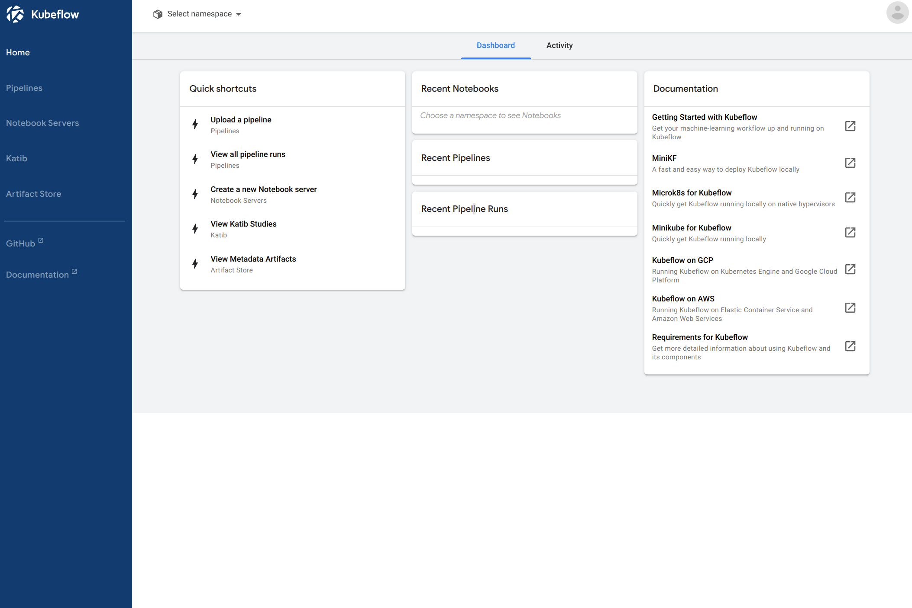
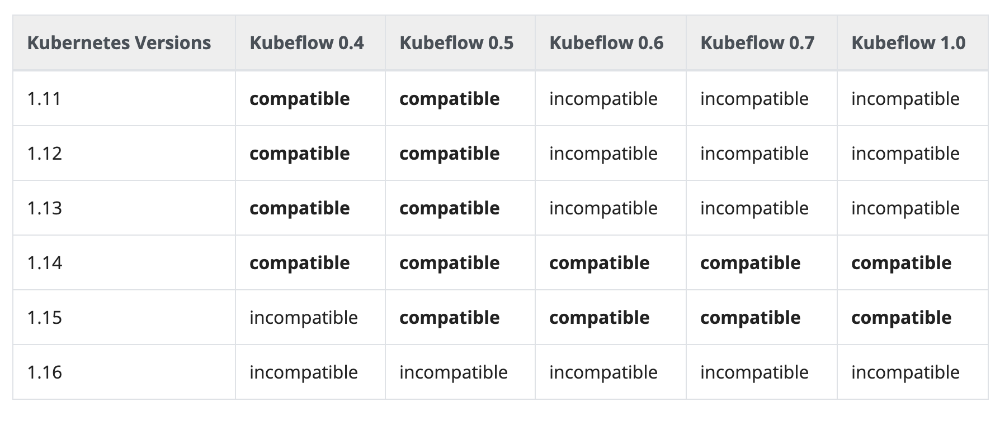

<!-- TOC -->

- [Overview](#overview)
- [K8s Version <=> KubeFlow version](#k8s-version--kubeflow-version)
- [Pre-condition](#pre-condition)
    - [Install Kustomize](#install-kustomize)
    - [Install kubectl 1.16](#install-kubectl-116)
    - [Install kfctl 1.0.0](#install-kfctl-100)
    - [Install Helm](#install-helm)
        - [update Helm repo](#update-helm-repo)
    - [Install NFS](#install-nfs)
        - [Install NFS software for server and client](#install-nfs-software-for-server-and-client)
        - [Select one VM as NFS Server, install server Config](#select-one-vm-as-nfs-server-install-server-config)
        - [Test Mount on Server/Client](#test-mount-on-serverclient)
        - [Permanent NFS mounting](#permanent-nfs-mounting)
        - [Verify the Mount](#verify-the-mount)
        - [Install Nfs-client-provisioner](#install-nfs-client-provisioner)
        - [Get the list of storageclass](#get-the-list-of-storageclass)
        - [Get Source Code of kubeflow Manifest](#get-source-code-of-kubeflow-manifest)
- [Install KF](#install-kf)
    - [Modify the Kube-apiserver yaml Settings](#modify-the-kube-apiserver-yaml-settings)
    - [Install Istio 1.13.1 with SDS enabled](#install-istio-1131-with-sds-enabled)
    - [Download Customized Kubeflow Manifest Code](#download-customized-kubeflow-manifest-code)
    - [Download the kubeflow manifests Tar Ball](#download-the-kubeflow-manifests-tar-ball)
    - [Remove istio-crds and istio-install section in "kfctlistiodex.v1.0.1.yaml"](#remove-istio-crds-and-istio-install-section-in-kfctlistiodexv101yaml)
    - [Modify URI of Manifest in kfctlistiodex.v1.0.1.yaml](#modify-uri-of-manifest-in-kfctlistiodexv101yaml)
    - [Remove "Cert-Manager" Namespace in k8s cluster](#remove-cert-manager-namespace-in-k8s-cluster)
        - [Force to Clean the "Terminating" Namespace in K8s](#force-to-clean-the-terminating-namespace-in-k8s)
    - [Start Install Kubeflow](#start-install-kubeflow)
- [Change the Deployment settings to use NFS](#change-the-deployment-settings-to-use-nfs)
    - [Creart PV to PVC of Kubeflow in case of them are not binding automatically](#creart-pv-to-pvc-of-kubeflow-in-case-of-them-are-not-binding-automatically)
        - [mysql-pv-claim](#mysql-pv-claim)
        - [minio-pv-claim](#minio-pv-claim)
        - [Metadata.yaml](#metadatayaml)
        - [katib-mysql.yaml](#katib-mysqlyaml)
- [Get the Dashboard URL](#get-the-dashboard-url)
    - [Check All Namespace Not Have Failed Depployment](#check-all-namespace-not-have-failed-depployment)
- [Accessing Kubeflow](#accessing-kubeflow)
    - [Add static users for basic auth](#add-static-users-for-basic-auth)
- [Expose Kubeflow](#expose-kubeflow)
    - [Secure with HTTPS](#secure-with-https)
    - [Expose with a LoadBalancer](#expose-with-a-loadbalancer)
        - [Deploy MetalLB:](#deploy-metallb)
        - [Ensure that MetalLB works as expected (optional):](#ensure-that-metallb-works-as-expected-optional)
        - [Create Certs for Load Balancer](#create-certs-for-load-balancer)
        - [Verfiy the LB for kubeflow is working](#verfiy-the-lb-for-kubeflow-is-working)
    - [Reverse-Proxy by nginx](#reverse-proxy-by-nginx)

<!-- /TOC -->


## Overview



## K8s Version <=> KubeFlow version
shows the relatioship between K8s and Kubeflow, detail is from https://www.kubeflow.org/docs/started/k8s/overview/. 
__But, this matrics has wrongly documented the kubeflow 1.0 over k8s 1.16, which is intercompitale. 
In fact, the developent of Kubeflow are mainly based on k8s 1.16.

In order to get kubeflow 1.0.1 version, we must focus on ** k8s 1.16 **

From Kubespray ** v2.12.0 ** starts to support the k8s 1.16;

## Pre-condition

This section  will continue on the k8s cluster, and assume that is ready for use.
After ssh into master node of k8s cluster, need to install below dependency and tools.

```
cd /opt
mkdir /kf-install && cd kf-install
```

### Install Kustomize
```
opsys=linux  # or darwin, or windows
curl -s https://api.github.com/repos/kubernetes-sigs/kustomize/releases/latest |\
  grep browser_download |\
  grep $opsys |\
  cut -d '"' -f 4 |\
  xargs curl -O -L
mv kustomize_*_${opsys}_amd64 kustomize
chmod u+x kustomize
```
- Move the binary
```
mkdir -p ${HOME}/bin
mv kustomize_*_${opsys}_amd64 ${HOME}/bin/kustomize
chmod u+x ${HOME}/bin/kustomize
```

### Install kubectl 1.16 
```
curl -LO https://storage.googleapis.com/kubernetes-release/release/v1.16.0/bin/darwin/amd64/kubectl
chmod 755 kubectl
mv kubectl /usr/local/bin
```

### Install kfctl 1.0.0 
```
curl -OL https://github.com/kubeflow/kfctl/releases/download/v1.0.1/kfctl_v1.0.1-0-gf3edb9b_linux.tar.gz
tar -xzvf kfctl*.tar.gz
chmod 755 kfctl
mv kfctl /usr/local/bin
```

### Install Helm
Helm version must be greater than 3, or the NFS client cannot be installed propperly.

```
$ curl -fsSL -o get_helm.sh https://raw.githubusercontent.com/helm/helm/master/scripts/get-helm-3
$ chmod 700 get_helm.sh
$ ./get_helm.sh
```

#### update Helm repo
```
$ helm repo add stable https://kubernetes-charts.storage.googleapis.com
$ helm repo update
```

### Install NFS

Refers from https://www.howtoforge.com/nfs-server-and-client-on-centos-7

#### Install NFS software for server and client

Go to ansible machine, and execute below commands:
```
ansible -i inventory/mycluster/hosts.yaml all -m raw -a "yum install -y nfs-utils"
ansible -i inventory/mycluster/hosts.yaml all -m raw -a "systemctl enable rpcbind && systemctl enable nfs-server && systemctl enable nfs-lock && systemctl enable nfs-idmap"
ansible -i inventory/mycluster/hosts.yaml all -m raw -a "systemctl start rpcbind && systemctl start nfs-server && systemctl start nfs-lock && systemctl start nfs-idmap"
```

#### Select one VM as NFS Server, install server Config

above commands will install all the dependency tools fro NFS in all VMs, so that any of VM can be used as NFS server.
we choose 172.31.51.143 as NFS server here.

```
vim /etc/exports 
 **put below**
/var/nfsshare    172.31.51.143(rw,sync,no_root_squash,no_all_squash)
/home            172.31.51.143(rw,sync,no_root_squash,no_all_squash)
```

Restart the NFS service
```
ssh 172.31.51.143
systemctl restart nfs-server
```

#### Test Mount on Server/Client

Select any VMs, try below command to verify the nfs service can be used by clients
```
mkdir -p /mnt/nfs/home
mkdir -p /mnt/nfs/var/nfsshare
mkdir -p /var/nfsshare
chmod -R 755 /var/nfsshare
mount -t nfs 172.31.51.143:/home /mnt/nfs/home/
mount -t nfs 172.31.51.143:/var/nfsshare /mnt/nfs/var/nfsshare/
```

if by Ansible commands
```
NFS_SERVER="172.31.51.143"
ansible -i inventory/mycluster/hosts.yaml all -m raw -a "mkdir -p /mnt/nfs/home && mkdir -p /mnt/nfs/var/nfsshare"
ansible -i inventory/mycluster/hosts.yaml all -m raw -a "mount -t nfs $NFS_SERVER:/home /mnt/nfs/home/ && mount -t nfs $NFS_SERVER:/var/nfsshare /mnt/nfs/var/nfsshare/"
```

#### Permanent NFS mounting
in order to automatically launch the NFS service in client, need to modify the /etc/fstab,

```
172.31.51.143:/home    /mnt/nfs/home   nfs defaults 0 0
172.31.51.143:/var/nfsshare    /mnt/nfs/var/nfsshare   nfs defaults 0 0
```

#### Verify the Mount

```
df -kh
```

#### Install Nfs-client-provisioner

```
 NFS_SERVER="10.0.0.12" --> the nfs server ip
 helm install --set nfs.server=$NFS_SERVER --set nfs.path=/var/nfsshare stable/nfs-client-provisioner --generate-name
 helm install nfs-client-provisioner --set nfs.server=$NFS_SERVER --set nfs.path=/var/nfsshare --set storageClass.name=nfs --set storageClass.defaultClass=true stable/nfs-client-provisioner
```

#### Get the list of storageclass

```
[root@node1 ~]# kubectl get storageclass -n kubeflow
NAME            PROVISIONER                                       AGE
nfs (default)   cluster.local/nfs-client-provisioner              51s
nfs-client      cluster.local/nfs-client-provisioner-1578379646   15m
```

- Check NFS version

```
nfsstat –s

[root@node1 ~]# nfsstat -s
Server rpc stats:
calls      badcalls   badclnt    badauth    xdrcall
13979      0          0          0          0

Server nfs v4:
null         compound
2         0% 13977    99%

Server nfs v4 operations:
op0-unused   op1-unused   op2-future   access       close        commit
0         0% 0         0% 0         0% 1485      2% 975       1% 218       0%
create       delegpurge   delegreturn  getattr      getfh        link
35        0% 0         0% 161       0% 10283    20% 741       1% 0         0%
lock         lockt        locku        lookup       lookup_root  nverify
266       0% 0         0% 213       0% 1561      3% 0         0% 0         0%
open         openattr     open_conf    open_dgrd    putfh        putpubfh
1077      2% 0         0% 0         0% 0         0% 13767    26% 0         0%
putrootfh    read         readdir      readlink     remove       rename
13        0% 968       1% 30        0% 0         0% 110       0% 36        0%
renew        restorefh    savefh       secinfo      setattr      setcltid
0         0% 0         0% 36        0% 0         0% 138       0% 0         0%
setcltidconf verify       write        rellockowner bc_ctl       bind_conn
0         0% 0         0% 4856      9% 0         0% 0         0% 0         0%
exchange_id  create_ses   destroy_ses  free_stateid getdirdeleg  getdevinfo
3         0% 4         0% 2         0% 213       0% 0         0% 0         0%
getdevlist   layoutcommit layoutget    layoutreturn secinfononam sequence
0         0% 0         0% 0         0% 0         0% 6         0% 13967    27%
set_ssv      test_stateid want_deleg   destroy_clid reclaim_comp
0         0% 0         0% 0         0% 1         0% 3         0%

```

#### Get Source Code of kubeflow Manifest
Kubeflow uses many docker images stored in "gcr.io", which cannot not avalaibe in China. it need to customize the kubeflow manifest code to replace it with "gcr.azk8s.cn". 

[Kubeflow installation](https://www.kubeflow.org/docs/started/getting-started/) is mainly for "Existing Kubernetes cluster using Dex for authentication". 

## Install KF

### Modify the Kube-apiserver yaml Settings

vim  /etc/kubernetes/manifests/kube-apiserver.yaml
```
    - --service-account-issuer=kubernetes.default.svc
    - --service-account-key-file=/etc/kubernetes/ssl/sa.pub
    - --service-account-signing-key-file=/etc/kubernetes/ssl/sa.key
    - --feature-gates=TokenRequest=true
```
k8s cluster will update automatically once yaml file is changed


### Install Istio 1.13.1 with SDS enabled

_Step 1_
```
# Download and unpack Istio
export ISTIO_VERSION=1.3.1
curl -L https://git.io/getLatestIstio | sh -
cd istio-${ISTIO_VERSION}
```
if git.io cannot visit, please use browser to download the release of istio 1.13.1 and put it in the folder of /opt/kf-install and then untar it.

_Step 2_

Enter the following command to install the Istio CRDs first:
```
for i in install/kubernetes/helm/istio-init/files/crd*yaml; do kubectl apply -f $i; done
```

_Step 3_
Create istio-system namespace
```
cat <<EOF | kubectl apply -f -
apiVersion: v1
kind: Namespace
metadata:
  name: istio-system
  labels:
    istio-injection: disabled
EOF
```
_Step-4_

Installing Istio with sidecar injection, SDS enabled **A template with sidecar injection enabled**
```
helm template --namespace=istio-system \
  --set sidecarInjectorWebhook.enabled=true \
  --set sidecarInjectorWebhook.enableNamespacesByDefault=true \
  --set global.proxy.autoInject=disabled \
  --set global.disablePolicyChecks=true \
  --set prometheus.enabled=false \
  `# Disable mixer prometheus adapter to remove istio default metrics.` \
  --set mixer.adapters.prometheus.enabled=false \
  `# Disable mixer policy check, since in our template we set no policy.` \
  --set global.disablePolicyChecks=true \
  --set gateways.istio-ingressgateway.autoscaleMin=1 \
  --set gateways.istio-ingressgateway.autoscaleMax=2 \
  --set gateways.istio-ingressgateway.resources.requests.cpu=500m \
  --set gateways.istio-ingressgateway.resources.requests.memory=256Mi \
  `# Enable SDS in the gateway to allow dynamically configuring TLS of gateway.` \
  --set gateways.istio-ingressgateway.sds.enabled=true \
  `# More pilot replicas for better scale` \
  --set pilot.autoscaleMin=2 \
  `# Set pilot trace sampling to 100%` \
  --set pilot.traceSampling=100 \
  install/kubernetes/helm/istio \
  > ./istio.yaml

  kubectl apply -f istio.yaml

```

_Step 5_
Replace External IP with NodePort
https://stackoverflow.com/questions/59077975/how-to-assign-an-ip-to-istio-ingressgateway-on-localhost
```
INGRESSGATEWAY=istio-ingressgateway
kubectl patch svc $INGRESSGATEWAY --namespace istio-system --patch '{"spec": { "loadBalancerIP": "<your-reserved-static-ip>" }}'
```


### Download Customized Kubeflow Manifest Code

here my "jia57196 repo" is used, but the offical kubeflow Manifest repo.

'''
git clone https://github.com/jia57196/manifests.git
cd manifests
git checkout v1.0-cn    ## this is the branch of replace the gcr repo with gcr.azk8s.cn
git pull -f
cp kfdef/kfctl_istio_dex.v1.0.1.yaml /opt/kf-install/
'''

### Download the kubeflow manifests Tar Ball
```
cd /opt/kf-install
curl -OL https://github.com/jia57196/manifests/archive/v1.0-azk8s-rc3.tar.gz
```

### Remove istio-crds and istio-install section in "kfctl_istio_dex.v1.0.1.yaml"

remove below section from the yaml file

**istio-crds**
```
  - kustomizeConfig:
      parameters:
      - name: namespace
        value: istio-system
      repoRef:
        name: manifests
        path: istio-1-3-1/istio-crds-1-3-1
    name: istio-crds
```
**istio-install**
```
  - kustomizeConfig:
      parameters:
      - name: namespace
        value: istio-system
      repoRef:
        name: manifests
        path: istio-1-3-1/istio-install-1-3-1
    name: istio-install
```

### Modify URI of Manifest in kfctl_istio_dex.v1.0.1.yaml

```
replace the below 
"uri: https://github.com/kubeflow/manifests/archive/v1.0.1.tar.gz"

with 
uri: /opt/kf-install/v1.0-azk8s-rc3.tar.gz

```


### Remove "Cert-Manager" Namespace in k8s cluster

```
ssh <k8s master>
kubectl delete namespace "Cert-Manager" --grace-period=0 --force
```

#### Force to Clean the "Terminating" Namespace in K8s

if deleting namespace stuck at "Terminating" state, we use below method to force clean the deleted namespace.

[Readings](https://success.docker.com/article/kubernetes-namespace-stuck-in-terminating)


_Step 1 GET the namespace object_
```
$ NAMESPACE=cert-manager
$ kubectl get ns $NAMESPACE -o json > ${NAMESPACE}.json
$ cat ${NAMESPACE}.json

```

_Step 2 Put Token into file_
```
UCP_URL=ucp.example.com
USERNAME=admin
PASSWORD=supersecretadminpassword
curl -sk -d "{\"username\":\"$USERNAME\",\"password\":\"$PASSWORD\"}" https://${UCP_URL}/auth/login | jq -r .auth_token > auth-token
```
            
_step 3 leaving only an empty array [] such as below example_
"finalizers": [
]

```bash
[root@node1 clean-namespace]# cat auth.json
{
    "apiVersion": "v1",
    "kind": "Namespace",
    "metadata": {
        "annotations": {
            "kubectl.kubernetes.io/last-applied-configuration": "{\"apiVersion\":\"v1\",\"kind\":\"Namespace\",\"metadata\":{\"annotations\":{},\"name\":\"auth\"}}\n"
        },
        "creationTimestamp": "2020-02-22T03:36:23Z",
        "deletionTimestamp": "2020-02-26T10:52:22Z",
        "name": "auth",
        "resourceVersion": "7397719",
        "selfLink": "/api/v1/namespaces/auth",
        "uid": "7fb1b109-5524-11ea-99cb-00163e08ad50"
    },
    "spec": {
       _"finalizers"_: [
        ]
    },
    "status": {
        "phase": "Terminating"
    }
}
```

_step 4 Reset the Namesapce_

```
curl -k -H "Content-Type: application/json" -H "authorization: Bearer $(cat ./auth-token)" -X PUT --data-binary @${NAMESPACE}.json https://localhost:6443/api/v1/namespaces/${NAMESPACE}/finalize
```

### Start Install Kubeflow
```
ssh <master ip> of k8s cluster
cd /opt/kf-install
delete .cache/ and kustomize/ folders in the kf app folder.

kfctl build -V -f kfctl_istio_dex.v1.0.1.yaml
kfctl apply -V -f kfctl_istio_dex.v1.0.1.yaml
```

## Change the Deployment settings to use NFS

By default, those 4 pvc are in Pending status, meaning these storage is not setup properly.
Need to change them to use "nfs"

- list down the existing pvc, and try to change their Storagaeclass to nfs

```
[root@node1 ~]# kubectl get pvc --all-namespaces
NAMESPACE   NAME             STATUS    VOLUME   CAPACITY   ACCESS MODES   STORAGECLASS   AGE
kubeflow    katib-mysql      Pending                                                     22h
kubeflow    metadata-mysql   Pending                                                     22h
kubeflow    minio-pv-claim   Pending                                                     22h
kubeflow    mysql-pv-claim   Pending                                      nfs            4h16m
```

- Command being used:

```
[root@node1 devops]# kubectl get pvc mysql-pv-claim -n kubeflow -o yaml > mysql-pv-claim.yaml
[root@node1 devops]# kubectl get pvc katib-mysql -n kubeflow -o yaml > katib-mysql.yaml
[root@node1 devops]# kubectl get pvc metadata-mysql -n kubeflow -o yaml >  metadata-mysql.yaml
[root@node1 devops]# kubectl get pvc minio-pv-claim -n kubeflow -o yaml >  minio-pv-claim.yaml

```

- And then modify the YAML files to add the right storageClassName under the spec section. For example:

```
# mysql-pv-claim.yaml
apiVersion: v1
kind: PersistentVolumeClaim
metadata:
  name: mysql-pv-claim
  namespace: kubeflow
  ...
spec:
  storageClassName: nfs
  ...
```

- Delete old Deployment and Apply the changed version

```
kubectl delete -f <PVC-NAME>.yaml
kubectl apply -f <PVC-NAME>.yaml
```

### Creart PV to PVC of Kubeflow in case of them are not binding automatically
if Helm version is lower, then the nfs client may cause the problem of binding problem. all of PVC for kubeflow alwasy are pending no matter change the "storageClassName" to "nfs".

https://stackoverflow.com/questions/34282704/can-a-pvc-be-bound-to-a-specific-pv

#### mysql-pv-claim
```
apiVersion: v1
kind: PersistentVolumeClaim
metadata:
  labels:
    app: mysql
    app.kubernetes.io/component: mysql
    app.kubernetes.io/instance: mysql-0.2.0
    app.kubernetes.io/managed-by: kfctl
    app.kubernetes.io/name: mysql
    app.kubernetes.io/part-of: kubeflow
    app.kubernetes.io/version: 0.2.0
  name: mysql-pv-claim
  namespace: kubeflow
spec:
  accessModes:
  - ReadWriteOnce
  resources:
    requests:
      storage: 20Gi
  storageClassName: ""

---

apiVersion: v1
kind: PersistentVolume
metadata:
  name: pv-mysql
spec:
  storageClassName: ""
  capacity:
    storage: 5Gi
  accessModes:
    - ReadWriteOnce
  persistentVolumeReclaimPolicy: Recycle
  claimRef:
    namespace: kubeflow
    name: mysql-pv-claim
  nfs:
    path: /var/nfsshare
    server: 172.31.51.151
```

#### minio-pv-claim
```
apiVersion: v1
kind: PersistentVolumeClaim
metadata:
  labels:
    app: minio
    app.kubernetes.io/component: minio
    app.kubernetes.io/instance: minio-0.2.0
    app.kubernetes.io/managed-by: kfctl
    app.kubernetes.io/name: minio
    app.kubernetes.io/part-of: kubeflow
    app.kubernetes.io/version: 0.2.0
  name: minio-pv-claim
  namespace: kubeflow
spec:
  accessModes:
  - ReadWriteOnce
  resources:
    requests:
      storage: 20Gi
  storageClassName: ""

---


apiVersion: v1
kind: PersistentVolume
metadata:
  name: pv-minio
spec:
  storageClassName: ""
  capacity:
    storage: 20Gi
  accessModes:
    - ReadWriteOnce
  persistentVolumeReclaimPolicy: Recycle
  claimRef:
    namespace: kubeflow
    name: minio-pv-claim
  nfs:
    path: /var/nfsshare
    server: 172.31.51.151
```

#### Metadata.yaml
```
apiVersion: v1
kind: PersistentVolumeClaim
metadata:
  labels:
    app.kubernetes.io/component: metadata
    app.kubernetes.io/instance: metadata-0.2.1
    app.kubernetes.io/managed-by: kfctl
    app.kubernetes.io/name: metadata
    app.kubernetes.io/part-of: kubeflow
    app.kubernetes.io/version: 0.2.1
    kustomize.component: metadata
  name: metadata-mysql
  namespace: kubeflow
spec:
  accessModes:
  - ReadWriteOnce
  resources:
    requests:
      storage: 10Gi
  storageClassName: ""

---

apiVersion: v1
kind: PersistentVolume
metadata:
  name: pv-metadata
spec:
  storageClassName: ""
  capacity:
    storage: 10Gi
  accessModes:
    - ReadWriteOnce
  persistentVolumeReclaimPolicy: Recycle
  claimRef:
    namespace: kubeflow
    name: metadata-mysql
  nfs:
    path: /var/nfsshare
    server: 172.31.51.151
```

#### katib-mysql.yaml

```
apiVersion: v1
kind: PersistentVolumeClaim
metadata:
  labels:
    app.kubernetes.io/component: katib
    app.kubernetes.io/instance: katib-controller-0.8.0
    app.kubernetes.io/managed-by: kfctl
    app.kubernetes.io/name: katib-controller
    app.kubernetes.io/part-of: kubeflow
    app.kubernetes.io/version: 0.8.0
  name: katib-mysql
  namespace: kubeflow
spec:
  accessModes:
  - ReadWriteOnce
  resources:
    requests:
      storage: 10Gi
  storageClassName: ""

---

apiVersion: v1
kind: PersistentVolume
metadata:
  name: pv-katib
spec:
  storageClassName: ""
  capacity:
    storage: 10Gi
  accessModes:
    - ReadWriteOnce
  persistentVolumeReclaimPolicy: Recycle
  claimRef:
    namespace: kubeflow
    name: katib-mysql
  nfs:
    path: /var/nfsshare
    server: 172.31.51.151
```

server: 172.31.51.151, here the IP is the nfs server IP.

## Get the Dashboard URL

```
export SECURE_INGRESS_PORT=$(kubectl -n istio-system get service istio-ingressgateway -o jsonpath='{.spec.ports[?(@.name=="https")].nodePort}')
export INGRESS_PORT=$(kubectl -n istio-system get service istio-ingressgateway -o jsonpath='{.spec.ports[?(@.name=="http2")].nodePort}')
export INGRESS_HOST=$(kubectl get po -l istio=ingressgateway -n istio-system -o jsonpath='{.items[0].status.hostIP}')
echo http://$INGRESS_HOST:$INGRESS_PORT

http://10.0.0.17:31380
```
here 10.0.0.17 is the internal IP of the VM (node). if visit it from outside, can use this VMs' Public IP to visit with corresponding ports are enabled.

### Check All Namespace Not Have Failed Depployment 

The "kfctl_istio_dex.v1.0.1.yaml" will create below namespace into k8s cluster
```
auth
knative-kfserving
kubeflow

cert-manager
istio-system
```


## Accessing Kubeflow

[Origin Document](https://www.kubeflow.org/docs/started/k8s/kfctl-istio-dex/) shows the basic steps on how to access Kubeflow. When kubeflow is installed in VMs of public cloud, do not use cloud load balancer to help on the ingress, since the kubeflow/istio does not know how to attach the cloud load balancer.

Here, more detail commented steps are shown in below, since orignal web page is too strict to beginer.

### Add static users for basic auth
```
# Download the dex config
kubectl get configmap dex -n auth -o jsonpath='{.data.config\.yaml}' > dex-config.yaml

# Edit the dex config with extra users.
# The password must be hashed with bcrypt with an at least 10 difficulty level.
# You can use an online tool like: https://passwordhashing.com/BCrypt

# After editing the config, update the ConfigMap
kubectl create configmap dex --from-file=config.yaml=dex-config.yaml -n auth --dry-run -oyaml | kubectl apply -f -

# Restart Dex to pick up the changes in the ConfigMap
kubectl rollout restart deployment dex -n auth
```

## Expose Kubeflow

### Secure with HTTPS
Since we are exposing our cluster to the outside world, it’s important to secure it with HTTPS. Here we will configure automatic self-signed certificates.

Edit the Istio Gateway Object and expose port 443 with HTTPS. In addition, make port 80 redirect to 443:
```
kubectl edit -n kubeflow gateways.networking.istio.io kubeflow-gateway
```

The Gateway Spec should look like the following:
```
spec:
  selector:
    istio: ingressgateway
  servers:
  - hosts:
    - '*'
    port:
      name: http
      number: 80
      protocol: HTTP
    # Upgrade HTTP to HTTPS
    tls:
      httpsRedirect: true
  - hosts:
    - '*'
    port:
      name: https
      number: 443
      protocol: HTTPS
    tls:
      mode: SIMPLE
      privateKey: /etc/istio/ingressgateway-certs/tls.key
      serverCertificate: /etc/istio/ingressgateway-certs/tls.crt
```

### Expose with a LoadBalancer

#### Deploy MetalLB:

_step 1 Apply the manifest:_
```
kubectl apply -f https://raw.githubusercontent.com/google/metallb/v0.8.1/manifests/metallb.yaml
```

_step 2_

Allocate a pool of addresses on your local network for MetalLB to use. You need at least one address for the Istio Gateway. This example assumes addresses 10.0.0.100-10.0.0.110. You must modify these addresses based on your environment.
```
cat <<EOF | kubectl apply -f -
apiVersion: v1
kind: ConfigMap
metadata:
  namespace: metallb-system
  name: config
data:
  config: |
    address-pools:
    - name: default
      protocol: layer2
      addresses:
      - 10.0.0.100-10.0.0.110
EOF
```
Notes:
"10.0.0.100-10.0.0.110" is not real IP range, they will be allocated after load balancer is created. it's CIDR must be same the Node Ip ranges, e.g. 172.31.51.0/24 is your CIDR, please choose, 172.31.51.100~172.31.51.110 for convinient to communicate within a overlay network.

#### Ensure that MetalLB works as expected (optional):

_Step 1_
Create a dummy service:
```
kubectl create service loadbalancer nginx --tcp=80:80
service/nginx created
```
_Step 2_

Ensure that MetalLB has allocated an IP address for the service:
```
kubectl describe service nginx
...
Events:
  Type    Reason       Age   From                Message
  ----    ------       ----  ----                -------
  Normal  IPAllocated  69s   metallb-controller  Assigned IP "10.0.0.101"
```
_Step 3_
Check the corresponding MetalLB logs:
```
kubectl logs -n metallb-system -l component=controller
...
{"caller":"service.go:98","event":"ipAllocated","ip":"10.0.0.101","msg":"IP address assigned by controller","service":"default/nginx","ts":"2019-08-09T15:12:09.376779263Z"}
```
_Step 4_
Create a pod that will be exposed with the service:
```
kubectl run nginx --image nginx --restart=Never -l app=nginx
pod/nginx created
```
_Step 5_
Ensure that MetalLB has assigned a node to announce the allocated IP address:
```
kubectl describe service nginx
...
Events:
  Type    Reason       Age   From                Message
  ----    ------       ----  ----                -------
   Normal  nodeAssigned  4s    metallb-speaker     announcing from node "node-2"
```
_Step 6_
Check the corresponding MetalLB logs:
```
kubectl logs -n metallb-system -l component=speaker
...
{"caller":"main.go:246","event":"serviceAnnounced","ip":"10.0.0.101","msg":"service has IP, announcing","pool":"default","protocol":"layer2","service":"default/nginx","ts":"2019-08-09T15:14:02.433876894Z"}
Check that MetalLB responds to ARP requests for the allocated IP address:
```

_Step 7_
```
arping -I eth0 10.0.0.101
...
ARPING 10.0.0.101 from 10.0.0.204 eth0
Unicast reply from 10.0.0.101 [6A:13:5A:D2:65:CB]  2.619ms
```
_Step 8_
Check the corresponding MetalLB logs:
```
kubectl logs -n metallb-system -l component=speaker
...
{"caller":"arp.go:102","interface":"eth0,"ip":"10.0.0.101","msg":"got ARP request for service IP, sending response","responseMAC":"6a:13:5a:d2:65:cb","senderIP":"10.0.0.204","senderMAC":"9a:1f:7c:95:ca:dc","ts":"2019-08-09T15:14:52.912056021Z"}
```
_Step 9_
Verify that everything works as expected:
```
curl http://10.0.0.101
...
<p><em>Thank you for using nginx.</em></p>
...
```

Notes:
Clean up
```
kubectl delete service nginx
kubectl delete pod nginx
```

#### Create Certs for Load Balancer

_Step 1:_
To expose Kubeflow with a LoadBalancer Service, just change the type of the istio-ingressgateway Service to LoadBalancer.
```
kubectl patch service -n istio-system istio-ingressgateway -p '{"spec": {"type": "LoadBalancer"}}'
```
_Step 2:_
After that, get the LoadBalancer’s IP or Hostname from its status and create the necessary certificate.
```
kubectl get svc -n istio-system istio-ingressgateway -o jsonpath='{.status.loadBalancer.ingress[0]}'
```
This command should return 10.0.0.100.
please note the 10.0.0.100 is the load balancer Ip instead of 10.0.0.101

__If this step does not return anything, something wrong is in Istio-ingressgateway__

_Step 3:_
Create the Certificate with cert-manager: <LoadBalancer IP> here is 10.0.0.100, dnsNames: leave this blank
```
apiVersion: cert-manager.io/v1alpha2
kind: Certificate
metadata:
  name: istio-ingressgateway-certs
  namespace: istio-system
spec:
  commonName: istio-ingressgateway.istio-system.svc
  # Use ipAddresses if your LoadBalancer issues an IP
  ipAddresses:
  - <LoadBalancer IP>
  # Use dnsNames if your LoadBalancer issues a hostname (eg on AWS)
  dnsNames:
  - <LoadBalancer HostName>
  isCA: true
  issuerRef:
    kind: ClusterIssuer
    name: kubeflow-self-signing-issuer
  secretName: istio-ingressgateway-certs
```

If use cloud Load Balancer, please be carefull put the Load Balancer poll on top of istio-ingressgateway host, can get the host by command
```
INGRESS_HOST=$(kubectl get po -l istio=ingressgateway -n istio-system -o jsonpath='{.items[0].status.hostIP}')
```

#### Verfiy the LB for kubeflow is working

1. the virtual services have been created:
```
kubectl get virtualservices -n kubeflow
kubectl get virtualservices -n kubeflow centraldashboard -o yaml
```
If not, then kfctl has aborted for some reason, and not completed successfully.

2. OIDC auth service redirects you to Dex:

```
curl -k https://<kubeflow address>/ -v
...
< HTTP/2 302
< content-type: text/html; charset=utf-8
< location:
/dex/auth?client_id=kubeflow-authservice-oidc&redirect_uri=%2Flogin%2Foidc&response_type=code&scope=openid+profile+email+groups&state=vSCMnJ2D
< date: Fri, 09 Aug 2019 14:33:21 GMT
< content-length: 181
< x-envoy-upstream-service-time: 0
< server: istio-envoy
```
Notes: user 10.0.0.100 as the <kubeflow address>/ in above test.

### Reverse-Proxy by nginx

Install Nginx server in any VM of k8s, to servcer as Ingress redirect to https:/10.0.0.100 LB.

Include the proper proper "ssl.conf" which consists of below location: 
```html
    location /kubeflow {
         proxy_ssl_trusted_certificate */ca.crt;  
         proxy_ssl_certificate tls.crt;                   
         proxy_ssl_certificate_key tls.key;
         proxy_ssl_session_reuse on;
         proxy_pass  https://10.0.0.100 ;
    }
```

"ca.crt, tls.crt, tls.key" Certs can be found from k8s "istio-system" Namespace, go to Namepsace dropdown list->istio-system, open "secrets", click "istio-ingressgateway-certs". Copy crt and keys out.

snapshot is [here]()