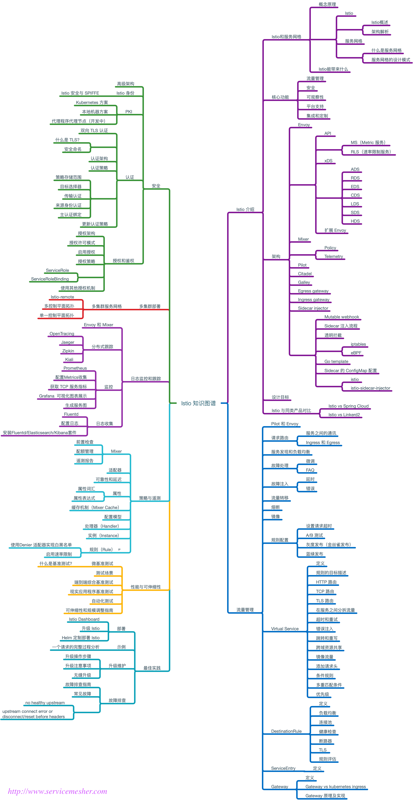
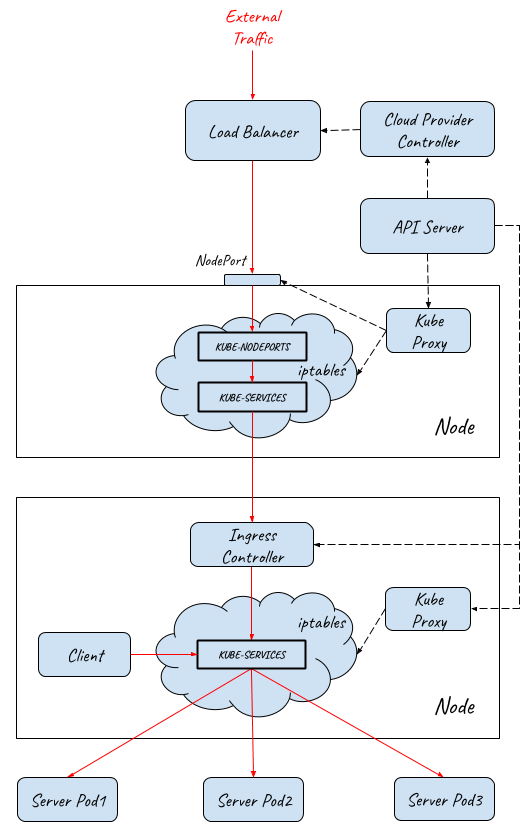

# Service Mesh Enablement to Large Scale Ditributed System

## Knowledge Update

[Paper](https://medium.com/@zhaohuabing/which-one-is-the-right-choice-for-the-ingress-gateway-of-your-service-mesh-21a280d4a29c) summarizes the types of Ingress Gateway in k8s cluster, and gives the recommendation to the real senarios.

Istio is the key component for the design of Ingress as well as Egress for application on top of k8s.

 shows what Istio covers.

## 3 Layers of Ingress

Architecture of 

consists of 3 layers from External Traffic to the Service Pod.

