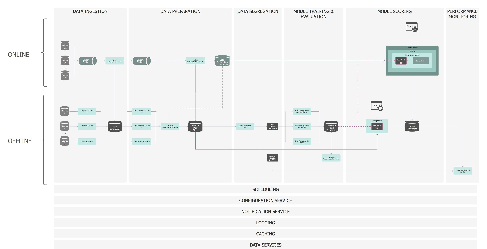
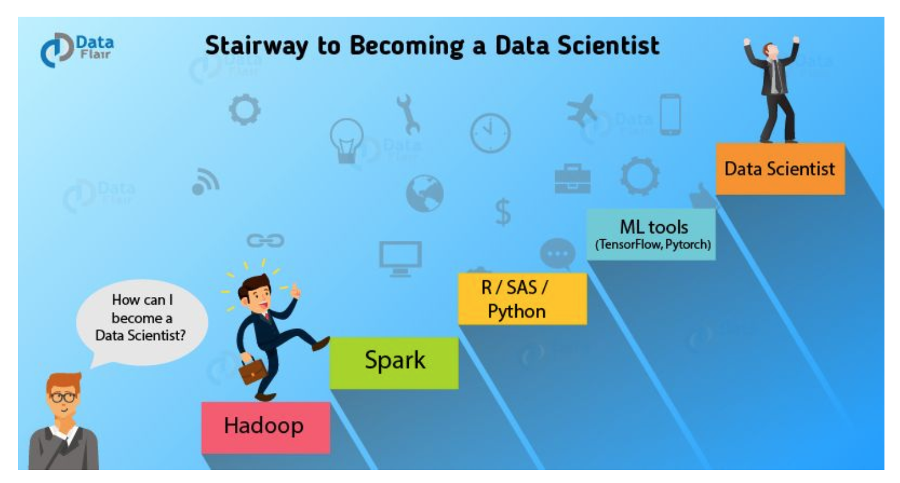
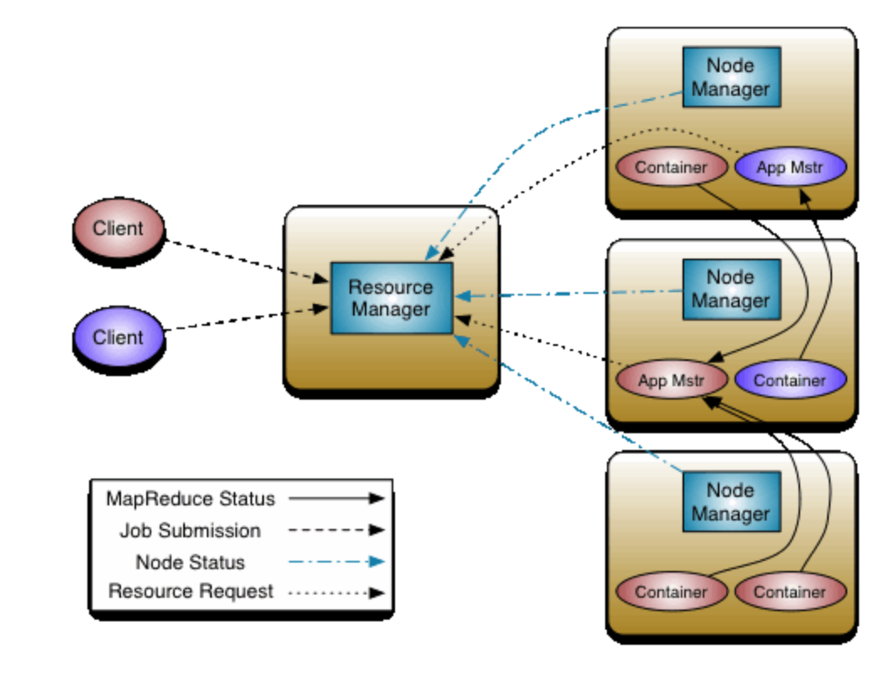
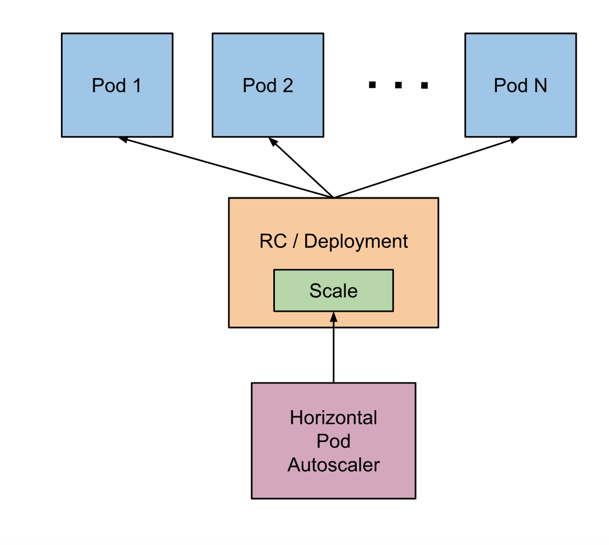
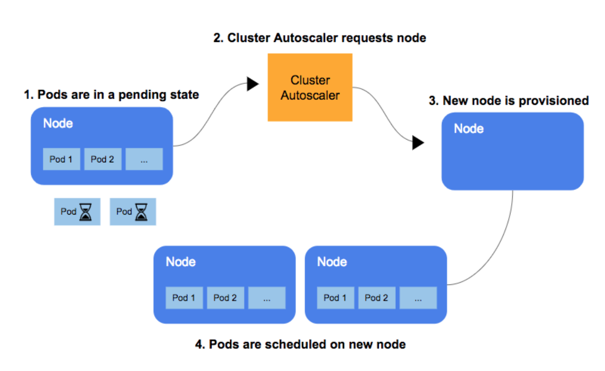

# Machine Learning Engineering Platform

Here is the repo for proving the concept of Implementing MLE platform by "Elastic PipeLine As Service", meanwhile with the draft UI for the team understanding on what will be built.

On This page:

- [Machine Learning Engineering Platform](#Machine-Learning-Engineering-Platform)

  - [1. Outline](#1-Outline)

  - [2. What Pipeline Looks like](#2-What-Pipeline-Looks-like)

    - [2.1 Benefits from Cloud-Native Architecture](#21-Benefits-from-Cloud-Native-Architecture)
    - [2.2 Principles of "Cloud-Native"](#22-Principles-of-%22Cloud-Native%22)
    - [2.3 Cloud-Native Applications Attributes](#23-Cloud-Native-Applications-Attributes)

  - [3. Big Data or Fast Data](#3-Big-Data-or-Fast-Data)

  - [4. Pipeline Orchestration](#4-Pipeline-Orchestration)
    - [RBAC vs Kerberos](#RBAC-vs-Kerberos)
    - [Orchestrating Multiple Models](#Orchestrating-Multiple-Models)
    - [Multitask Inside of Pipelines](#Multitask-Inside-of-Pipelines)
    - [Feature Mart](#Feature-Mart)
  - [5. Why not need Hadoop and Yarn?](#5-Why-not-need-Hadoop-and-Yarn)
    - [5.1 How Hadoop Ecosystem Help Daily Work of Data Scince?](#51-How-Hadoop-Ecosystem-Help-Daily-Work-of-Data-Scince)
    - [5.2 Missing Marks for Complex Analytics](#52-Missing-Marks-for-Complex-Analytics)
    - [5.3 What Hadoop Said?](#53-What-Hadoop-Said)
      - [5.3.1 Hadoop Yarn vs Kuberneters](#531-Hadoop-Yarn-vs-Kuberneters)
    - [5.4 Spark Streaming ≠ Spark Cluster?](#54-Spark-Streaming-%E2%89%A0-Spark-Cluster)
      - [5.4.1 Headaches from Spark Ecosystem](#541-Headaches-from-Spark-Ecosystem)
      - [5.4.2 Current SPIP](#542-Current-SPIP)
    - [5.5 Yarn Alternatives](#55-Yarn-Alternatives)
    - [5.6 Flink is the King?](#56-Flink-is-the-King)
      - [5.6.1 Flink is not Ready for Model Serving](#561-Flink-is-not-Ready-for-Model-Serving)
  - [6. Stateless Stream Processing](#6-Stateless-Stream-Processing)
    - [6.1 How To Achieve the Stateless](#61-How-To-Achieve-the-Stateless)

## 1. Outline

[Semi Koen][3] suggested good practice in "Architecting a Machine Learning Pipeline", which summary the main process and phases in machine learning engineering architecting and development.


1. Resource Management, Yarn alternative --- ["ManageEngine"](https://www.manageengine.com), which can mointor anything in cluster 24\*7, not only for the CPU, memorys, but microservices.
2. Scheduling, Can keep using Airflow, but K8s has its own schedueler
3. Sinkable Pipeline -- Real Time Flink Pipeline, Spark Pipeline, Data Transform Pipeline, Aggregation Pipeline, Model Training Pipeline, Score pipeline, and Prediction Pipeline etc.
   Each pipeline is service, being equiped by Rest API for communication with Resource Management, Configuration, gRPC for streaming with other service, websocket(WS) for notification.
4. Logging, ELK and Kibana.
5. CACHING, Alluxio (seems not the best choice now)
6. Data Services, DI, Sparkcolar, Presto.

## 2. What Pipeline Looks like

In terms of definition of pipeline, there must have input and output from both side of that line of pipe, further, line of process.

"Elastic Pipeline As Service" is meant of lifecycle of pipelines of processes/modules as microservices, which can be capable of scaling out in horizontal as well as pure Cloud-Native based. "Elastic" is emphasized here in aims of support different working type of languages that Data Scientist most familiar with, e.g. using pySpark, spark java.

Why Cloud-native is emphasized here, and why this "Elastic Pipeline As Service" has to inherit the merits from concept of Cloud-native? In fact, [“Cloud-Native”](https://github.com/cncf/toc/blob/master/DEFINITION.md) is an approach to building and running applications that exploits the advantages of the cloud computing delivery model. “Cloud-native” is about how applications are **created** and **deployed**, not where. It implies that the apps live in the public cloud, as opposed to an on-premises datacenter.

Before designing an application, it's important to put the principles of "Cloud-Native" in mind, or will run into many problems for development and later in deployment.

### 2.1 Benefits from Cloud-Native Architecture

Design of an application with adopting Cloud-Native Architecture is not a matter of buzzword compliance, but the advantages being beneficial to business and organizations.

[Article][10] summarise those 6 benefits,

- Faster release pace
- Superior customer experiences
- Ease of management
- Reduced cost through containerization & cloud standards
- Build more reliable systems
- Avoid vendor lock-in

### 2.2 Principles of "Cloud-Native"

Google has [documented][1] 5 principles of "Cloud-Native"

- Principle 1: Design for automation
- Principle 2: Be smart with state
  "design components to be stateless" will make the components and applications easily to "scale", "repair", "Roll-Back", "Load-balance across"
- Principle 3: Favor managed services
- Principle 4: Practice defense in depth
- Principle 5: Always be architecting

### 2.3 Cloud-Native Applications Attributes

Following the principles mentioned-above, most Cloud-Native applications has below [attritutes][2]

- Packaged as lightweight containers
- Developed with best-of-breed languages and frameworks
- Designed as loosely coupled microservices
- Centered around APIs for interaction and collaboration
- Architected with a clean separation of stateless and stateful services
- Isolated from server and operating system dependencies
- Deployed on self-service, elastic, cloud infrastructure
- Managed through agile DevOps processes
- Automated capabilities
- Defined, policy-driven resource allocation

## 3. Big Data or Fast Data

Many companies discovered that they don’t really have "big data" (the exact meaning of which was never defined precisely); but they might have several data streams coming their way, just waiting to be leveraged. Ideally, "Pipeline As Service" will use the fastest way to process big data, stream big data into mature analytics platforms, if need integrating with them, e.g. MLflow, KubeFlow.

## 4. Pipeline Orchestration

### RBAC vs Kerberos

User Session, Job scheduling, and cluster Monitoring and Maintenance.

### Orchestrating Multiple Models

Produce the complex classification and prediction results from different models services.
Model Service will be equipped specific machine learning back-end service.

### Multitask Inside of Pipelines

### Feature Mart

## 5. Why need Hadoop and Yarn?
```html

```
> Questions: "Why we should use Hadoop and Spark?"

Above [snapshot]("https://data-flair.training/blogs/hadoop-for-data-science") answers most common question implicitly.

In another hand, when we develope a machine learning analytics platform, some of the stakeholders will answer such question in different way.

- Software Engineer: "because boss wanted to use"
- Architect: "Since most technology companies use Hadoop"
- Banker: "if not use, what else can be chosen?"

### 5.1 How Hadoop Ecosystem Help Daily Work of Data Scince?

- Data Exploration, 80% of a data scientist’s time is spent in data preparation and data exploration plays a vital role in it
- Filtering Data, Under rare circumstances data scientists build a machine learning model or a classifier on the entire dataset. They need to filter data based on the business requirements.
- Data Sampling, Without sampling the data, a data scientist cannot get a good view of what’s there in the data as a whole
- Summarization, Summarizing the data as a whole, using Hadoop MapReduce helps data scientist get a bird’s-eye of better data building models.

### 5.2 Missing Marks for Complex Analytics

In below two areas,

- Involving Machine Learning
- [principal component analysis](https://en.wikipedia.org/wiki/Principal_component_analysis)

Hadoop might be unworkable for data science when,

- There are millions of products and customers for recommendations, multi-tenancy for multiple session based data pipelines
- It requires processing genetic sequencing data (Time-serieas, historical) on huge arrays, aggregation, joins between/among tables
- The business use case requires gleaning **real-time** insights from sensor(transactions) or **graphical data** through powerful noise reduction algorithms

### 5.3 What Hadoop Said?

["Hortonworks unveils roadmap to make Hadoop cloud-native"][8] summarizes that "Hadoop is not currently a platform that fully exploits the capabilities of the cloud. Aside from slotting in S3 or other cloud storage in place of HDFS, Hadoop does not fully take advantage of the cloud architecture. Making Hadoop cloud-native is not a matter of buzzword compliance, but making it more fleet-footed". Meanwhile, this article announced 3 steps to transform Hadoop into Cloud-Native Platfrom, 3 Steps are:

- 1. Rearchitect all the components of Hadoop as containers
- 2. Encompass separating compute from data, not really rely on HDFS, but S3 or Azure Blob Store
- 3. Involves support of Kubernetes

Step 1) and Step 2) are well progressed, since now we can see the Yarn spawn new resource as docker containers of application and launch them in cluster.
however, questions come subsequently,

    - do those containerization application (whatever is spark related or not) from Yarn are managed with traffice egress?
    - do those containerization application is replicated each other?

Step 3) Involves support of Kubeternates" introduced a new service of "DataPlane Services (DPS)", which does consistent security and data governance across all tiers. However, this "DataPlane Services" and Yarn are more redundant to the Kubeternates and its component. Why we need two set similar tools doing same thing? Section [Hadoop Yarn vs Kubeternates](#Hadoop-Yarn-vs-Kubeternates) will discuss this.

Not surprisingly, the cloud providers are having the last word: in the cloud, cloud storage has become the default ingest point for data. And so cloud providers are making their cloud object stores directly queryable. Amazon has made S3 directly accessible to SQL ad hoc query with Athena, and as an extension of the data warehouse with Redshift Spectrum. Google Cloud has long made its cloud storage the default source for BigQuery, while Snowflake, a third-party cloud data warehouse, has done the same.

In short, Hortonwork roadmap become a dose of placebo for exisiting users.

Now, problem is we should wait Hadoop Cloud-Native to be happened this year or next year, since Architecture change will introduce huge effort to put in product ionization.
Another problem is, "Does Clould-Native Hadoop can help us fulfill this domain specific requirement and solve current headache without introduce another headache? " Right now, Hadoop and Yarn ecosystem looks not necessaries in contrast with Cloud-Native centric Applications since there are many alternative means, utilities tools helping in compliance to those principles of Cloud-Native and therefore get benefits from.

- Faster release pace
- Superior customer experiences
- Ease of management
- Reduced cost through containerization & cloud standards
- Build more reliable systems

#### 5.3.1 Hadoop Yarn vs Kuberneters

The fundamental idea of YARN is to split up the functionalities of resource management and job scheduling/monitoring into separate daemons. [Diagram](./pic/yarn.png) shows the overall collaborations within cluster.



Kuberneters has broader capability on scheduling/monitoring the resource for PODs(container pool) and Nodes (host of the PODSs). Herein, the resource consists of only the CPU, Memory of the PODs, but nodes to be previoned.

**kube-scheduler**
Component on the master that watches newly created pods that have no node assigned, and selects a node for them to run on. Factors taken into account for scheduling decisions include individual and collective resource requirements, hardware/software/policy constraints, affinity and anti-affinity specifications, data locality, inter-workload interference and deadlines. In short, kube-scheduler does the job of "Horizontal Pod Autoscaler work", see below diagram



Kubernetes scheduler doesn't succeed to allocate new pods that may be created with Spark's dynamic resource allocation in the future (not implemented yet), it's able to mount necessary nodes dynamically (e.g. through https://github.com/kubernetes/autoscaler/tree/master/cluster-autoscaler#introduction).

**kube Cluster Autoscaling**
Clusters are how Kubernetes groups machines. They are comprised of Nodes (individual machines, oftentimes virtual) which run Pods. Pods have containers that request resources such as CPU, Memory, and GPU. The Cluster Autoscaler adds or removes Nodes in a Cluster based on resource requests from Pods.
[Cluster Autoscaler](https://github.com/kubernetes/autoscaler/tree/master/cluster-autoscaler#introduction) automatically adjusts the size of the Kubernetes cluster. See below diagram for test phases of process.



With full features autoscale in both vertical and horizontal autiscaler, kubernetes left Hadoop new component "DataPlane Services (DPS)" far behind.

### 5.4 Spark Streaming ≠ Spark Cluster?

Spark is becoming more and more popular in data science daily work. Further, Getting rid of Spark from their daily work is not the matter of why and how.
Platform is going not only support current data scientist habit on spark, but what if the new platform has provided alternatives to data scientist, an impressive unified UI/UX wrapping functionalities covering their daily work, they might not argue that where the spark is.

[TBD]

#### 5.4.1 Headaches from Spark Ecosystem

- Perfomance Issue, Latency issue (micro-batching time windows is 1s)
- Resource Racing, Jobs never be unsigned with allocated resource to run
- Application on Spark, either in or out of Spark Context, is stateful streaming processing.
  How the stateful streaming processing matter?
  [Answer] Really matter, any solutions here for this stateful streaming processing cannot neatly the problem, more or less introducing new problem.
  Section [Stateless Sinkable Stream Processing](#)

#### 5.4.2 Current SPIP

Current "Spark Project Improvement Proposals" consists of many below items.

> - Columnar Processing -
>   As we know, if aggregating on big dataset in spark, pyspark, sparkml, full table scanning is triggered. That will introduce the performance downgrade and big memory usage.
>   To solve this full table scanning, [Columnar Processing](7) is proposed but now yet ready to production for Spark 3.

Spark Streaming will not be related to Spark Cluster in context.

### 5.5 Yarn Alternatives

[Kuberneters + Airflow](https://kubernetes.io/blog/2018/06/28/airflow-on-kubernetes-part-1-a-different-kind-of-operator/) is a good alternative to Yarn.

### 5.6 Flink is the King?

Flink is thought slower 1.7x than Spark when processing batch based large scale data set. And, when we look at their commmunity, we could find that "Model serving" is still under development, refers to [Current Flink Improvements Proposals(FLIP)](https://cwiki.apache.org/confluence/display/FLINK/FLIP-23+-+Model+Serving)

#### 5.6.1 Flink is not Ready for Model Serving

For the general case the user runs N models. There might be more than one instance per model for performance reasons. It is often true that a model is fed with a pre-processed stream of data and then the output. Now within the same pipeline it is also possible to run multiple models:

a) Model Segmentation
b) Model Ensemble
c) Model Chaining
d) Model Composition

From the point of view of model serving, we always treat a pipeline as a single model, regardless of the amount of models encoded in it. User can always compose pipelines (or models in the simple case) as part of the overall processing being done, but if this can be achieved via the supported model format eg. PMML then it might be the prefered way to do it since this will be managed automatically by the library implementing the specific format.

Another case is to run multiple versions of the same machine learning pipeline within the serving system. One reason can be A/B testing.

For the purpose of this implementation, we consider versions of a model as different models. If the versioning is important, we recommend an external system, managing model’s versions, but assigning them unique Ids so that we can treat them as different one for the purpose of serving.

## 6. Stateless Stream Processing

Both Spark and Flink has same mission, even though Spark uses "micro-batch" window concept to hanle "real time" problem.
However,

[Article](15) summaries the two types of streaming processing,
In stateless stream processing, the way each event is handled is completely independent from the system’s state. All processing is based on each incoming event. Given an event, the stream processor will process it exactly the same way every time, no matter what the state of the system is. For example, you can think of a bank teller that "processes" a stream of customers, one at a time.

In stateful stream processing, on the other hand, there is a “state” that impacts event processing. As a result, either static state or past events can influence the way incoming events are processed. For example, if you want to average the value for the last 10 minutes of events that occur every second, this means that you need to keep the state containing the last 600 events.

I am not talking about which processing is bad or good, but "Stateful" processing has many problems when design a Clould-Native application epecially for kinda "Machine Learning Platform".

In terms different storage, the stateful problems look different. In [Article](15), they are

> **local, in-memory storage**

- Failover - restarting the stream processing system will not restore the state
- Scaling - scaling up and down will typically require state to be moved from one processor to another.

> **by external store**

- Adding additional components to the system, which will make the overall implementation more complex and consequently harder to manage.
- Reliability concerns; if the external database goes down, the whole system is down
- Performance implications - performance of the external store limits the performance of the overall stream processing. For example, it can become a bottleneck.

### 6.1 How To Achieve the Stateless

By any means, making the statefull data set to be replica to any application instances, is the foundamental theory.


[1]: https://cloud.google.com/blog/products/application-development/5-principles-for-cloud-native-architecture-what-it-is-and-how-to-master-it "Principles of Cloud-Native"
[2]: https://thenewstack.io/10-key-attributes-of-cloud-native-applications "10 Key Attributes of Cloud-Native Applications"
[3]: https://towardsdatascience.com/architecting-a-machine-learning-pipeline-a847f094d1c7 "Architecting a Machine Learning Pipeline"
[4]: https://softwaremill.com/windowing-in-big-data-streams-spark-flink-kafka-akka "Windowing data in Big Data Streams - Spark, Flink, Kafka, Akka"
[5]: https://cwiki.apache.org/confluence/display/FLINK/FLIP-23+-+Model+Serving "FLIP-23 - Model Serving"
[6]: https://www.protechtraining.com/blog/post/spark-ml-from-lab-to-production-picking-the-right-deployment-architecture-for-your-business-910 "Spark ML from Lab to Production: Picking the Right Deployment Architecture for Your Business"
[7]: https://issues.apache.org/jira/browse/SPARK-27396?jql=project%20%3D%20SPARK%20AND%20status%20in%20(Open%2C%20Reopened%2C%20%22In%20Progress%22)%20AND%20(labels%20%3D%20SPIP%20OR%20summary%20~%20%22SPIP%22)%20ORDER%20BY%20createdDate%20DESC "Spark Current SPIP"
[8]: http://mleap-docs.combust.ml "Mleap"
[9]: https://www.zdnet.com/article/hortonworks-unveils-roadmap-to-make-hadoop-cloud-native "Hortonworks unveils roadmap to make Hadoop cloud-native"
[10]: https://www.architech.ca/6-benefits-of-cloud-native-applications-for-business/ "6 Benefits of Cloud-Native Applications for Business"
[11]: https://www.dezyre.com/article/is-it-necessary-to-learn-hadoop-to-become-a-data-scientist-/253 "Why a data scientist should use Hadoop for Data Science"
[12]: https://spark.apache.org/docs/latest/running-on-kubernetes.html "Running Spark on Kubernetes"
[13]: https://jobs.zalando.com/tech/blog/running-apache-flink-on-kubernetes "Running Apache Flink on Kubernetes"
[14]: https://medium.com/kubecost/understanding-kubernetes-cluster-autoscaling-675099a1db92 "Understanding Kubernetes Cluster Autoscaling"
[15]: https://towardsdatascience.com/a-step-by-step-explanation-of-principal-component-analysis-b836fb9c97e2 "A step by step explanation of Principal Component Analysis"
[16]: https://www.lightbend.com/blog/managing-streaming-and-queryable-state-in-spark-akka-streams-kafka-streams-flink "Design Techniques for Building Streaming Data, Cloud-Native Applications"
[17]: https://martinfowler.com/bliki/CQRS.html "Command Query Responsibility Segregation"
[18]: https://www.lightbend.com/blog/cloud-native-streaming-data-with-akka-streams-kafka-steams "Design Techniques for Building Streaming Data, Cloud-Native Applications: Part 2 - Akka Streams, Kafka Streams, and Friends"
