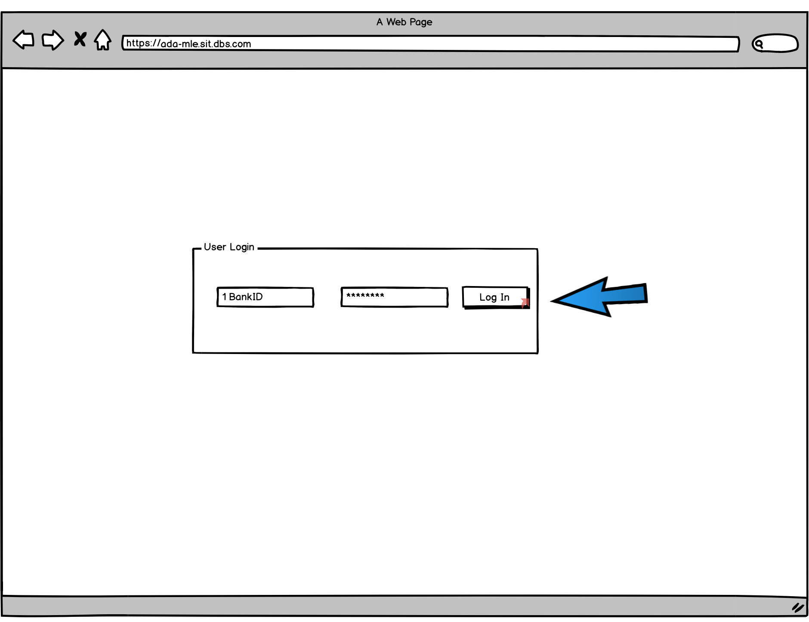
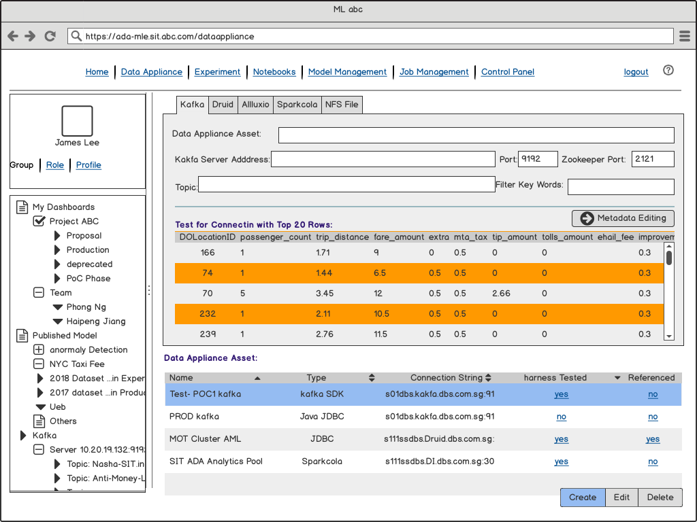
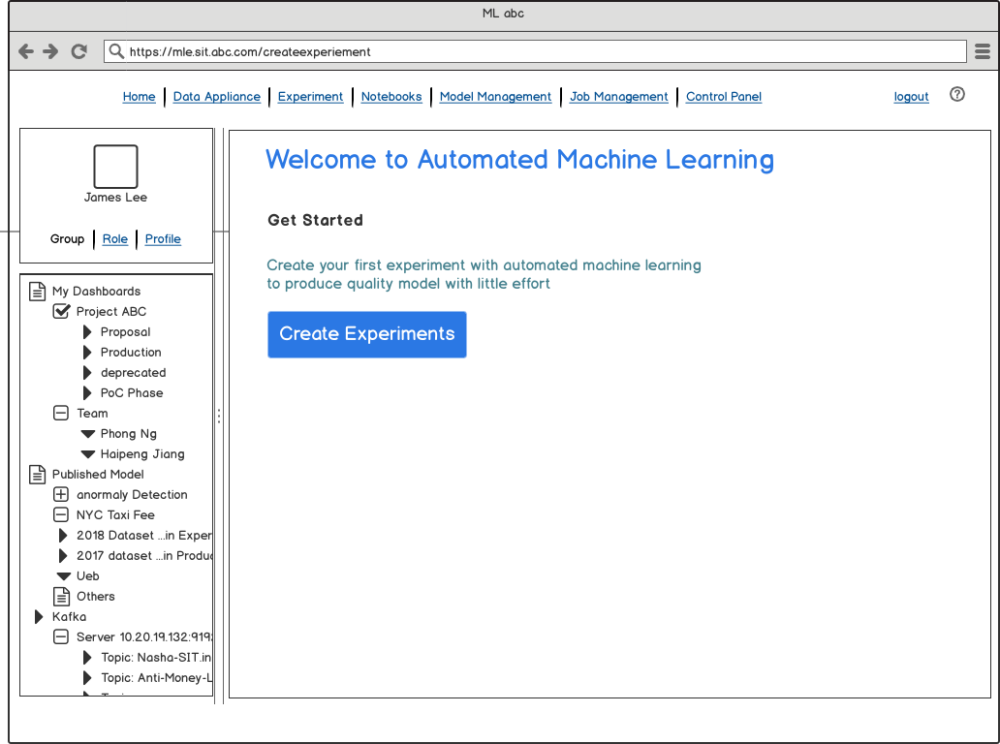

This section present the wired-framed web pages to streanline the thoughts based-on AI/ML common Use-cases.
Apart of the way to achieve the end-user's expected product/platform, the logic Model training, registry, govenance, and production API monitoring, are pretty much same among different industry.

- [UI/UX Use Cases](#UIUX-Use-Cases)
  - [Login](#Login)
  - [Home Dashboard](#Home-Dashboard)
  - [Data Appliance(Elastic Pipelines)](#Data-ApplianceElastic-Pipelines)
  - [Experiments](#Experiments)
  - [Notebook](#Notebook)
  - [Model Management](#Model-Management)
  - [Deployment](#Deployment)
  - [Control Panel](#Control-Panel)
  - [Matrics and Monitoring DashBoard](#Matrics-and-Monitoring-DashBoard)
  - [ACL and RBAC](#ACL-and-RBAC)

## Login

## Home Dashboard

## Data Appliance(Elastic Pipelines)

## Experiments

## Notebook

## Model Management

## Deployment

## Control Panel

## Matrics and Monitoring DashBoard

## ACL and RBAC
