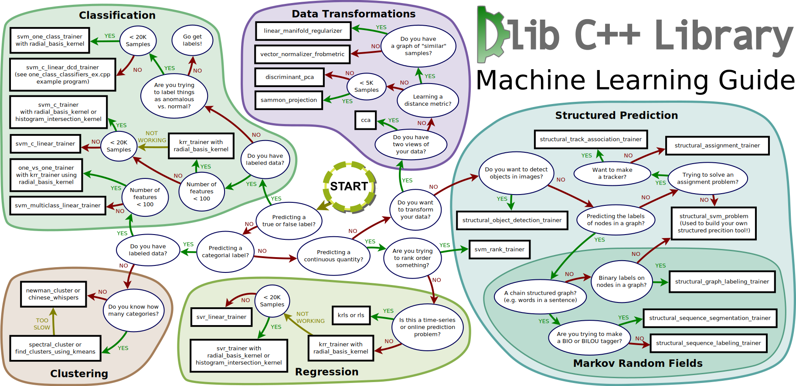
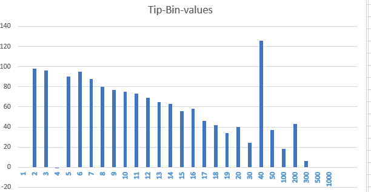
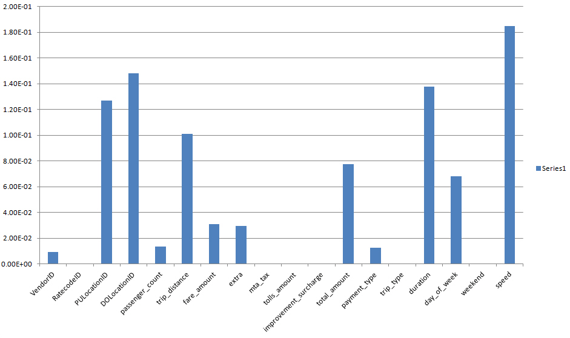
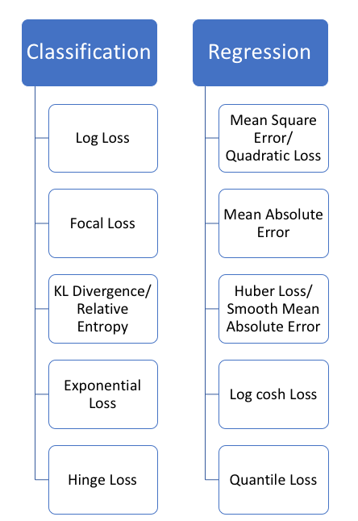
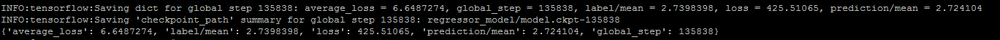

# NYC Tips Prediction According To 2017 Dataset
Author: *Searoc Jiang*

# 0. Overview

## Problem Statement

    Use GYC Green Taxi data to implement a machine learning system to predict the expected tip amount for a trip.

*_Reference_*

  Thank for below github repos owners, they have good ideas and model for me to learn.

- Machine Learning Example
  https://github.com/kthouz/NYC_Green_Taxi.git

- Spark ML Example
  https://github.com/yennanliu/NYC_Taxi_Trip_Duration

- Python Notebook Example
  https://github.com/josemazo/nyc-taxi-tip-predictor.git

- Deep Learning Example
  https://github.com/jkschin/nyc_taxi.git

- Feature Engineering Consideration
  https://github.com/Jenniferz28/NYC-Taxi-Tip-prediction.git

Below work will consolidate all above good practice, make analysis based on their results according to the 2017 Jan and Feb dataset.

Besides of above reference, a reasonal way to find out the best model and optimized set of parameters depends the understanding the problem itself when we look at the data structure and predicable target data. Secondly, choosing a solid method to screen the modelling and finally putting them under systmatic analytic in order to find out the best of best in terms of speed, accruacy and resource consumption etc, are needed.

Now, what is my understanding to this problem?
Below has summarized a path for choosing suitable method for modelling. 

Based on above figure, our problem can be concluded as "Regression" problem.

# 1. Data Source

Original dataset is from: https://data.cityofnewyork.us/Transportation/2017-Green-Taxi-Trip-Data/5gj9-2kzx

Run command to get the data sets: Jan 2017 data is train set, Feb 2017 is test set.

```html
$ python clean_dataset.py
```

**Output dir is：./data/**

- test.csv
- test_tips_only.csv
- train.csv
- train_tips_only.csv

_DataSet Columns:_

```html
Dataset columns：
VendorID,
lpep_pickup_datetime,
lpep_dropoff_datetime,
store_and_fwd_flag,
RatecodeID,
PULocationID,
DOLocationID,
passenger_count,
trip_distance,
fare_amount,
extra,
mta_tax,
tip_amount,
tolls_amount,
ehail_fee,
improvement_surcharge,
total_amount,
payment_type,
trip_type,
duration,
day_of_week,
weekend,
speed,
tip
```

# 2. Machine Learning Model

As the preditable target column is "tip_amount", an continous quantity, we should better consider the "Regression" mothed, since "tip_amount" variable is a real-value, floating point value.

## 2.1 Solving Regression Problem by Classfication Method

Year 2015， [Azure ML] uses “Multiclass logistic regression learner" to model this problem and make the prediction, though the dataset columns are quite different to 2017 DataSet here being used. From which, many works are documented as basic steps to modeling even make prediciotn.

- Multiclass Tip Bins

- Label distribution

- Feature Engineering

- Build Count Transform

In other hand, this is typical called discretization and the resulting output variable is a classification where the labels have an ordered relationship (called ordinal).

In term of "Label Distribution" of tip_amount, we can see the scatter distribution among [0 - 1000] dollars according to above Jan~Feb 2017 dataset.



I tried to import that model into azure ML studio and convert to new model specifically handling 2017 dataset. Since I pick number of "tip_mount" bin as 31, which is dipected from above diagram, the model trainning always stopped by ignoring error which might be caused by the number of "tip_mount" bin.

If I choose small numbe of "tip_amount" bin, e.g. 5, it will lose accuracy of prediction.
In the end, “Multiclass logistic regression learner" is not choosen as the model to do the prediction of "tip_amount" since Logistic regression is classfication method, even though itself name has word "Rgression".

## 2.1.1 Model Training

Prof. Jason Brownlee documented a list of algos in his article, [_'A Tour of Machine Learning Algorithms'_](https://machinelearningmastery.com/a-tour-of-machine-learning-algorithms/)

In notebook [Evaluate Machine Models](data/evaluate-model), studies the algo accuracy.

_"Section Overview"_ lists down different types of prediction to tip amount.  
In below sections, many [models](https://machinelearningmastery.com/a-tour-of-machine-learning-algorithms/ithms) will be considered to make classification and prediction.

- Random Forest
- Ehanced Random Forest
- GBT, Gradient Boosting
- XGB, eXtreme Gradient Boosting
- DNN by keras

### 2.1.2 Feature Engineering

Before doing the features selection, strategy should be more clear in our mind,

- a) Run the RFE on any linear / tree model to reduce the number of features to some desired number n_features_to_select. Perform the RFE algorithm on a sklearn-based algorithm to observe feature importance. Finally, you use the most importantly observed features to train your algorithm based on Keras.
- b) Use regularized linear models like lasso / elastic net that enforce sparsity. The problem here is that you cannot directly set the actual number of selected features. (
- c) Use any other feature selection technique from [here](http://scikit-learn.org/stable/modules/feature_selection.html)

Since the big difference between Machine Learning and Deep Learning especially "DNN", is who will do the learning of feature extraction. Simply for this article, data columns are chosen from Machine Learning feature selection done by sklearn, and then feed into DL model.

The notebook ['Feature-selection'](./notebook/xgb-features-importance.ipynb) show detail algorithms as well as the selected feature list.

With xgb feature selection program [here](./notebook/xgb-features.ipynb), the importance of features is plotted in below figure


_**Feature list to be used**_

```html
VendorID,
PULocationID,
DOLocationID,
passenger_count,
trip_distance,
fare_amount,
extra,
tip_amount,
total_amount,
payment_type,
duration,
day_of_week,
speed
```

_Note: The program only extract the first of 5000 samples to generate the above distribution of feature importance due to the memory size in the working node. And, to be fairly covrage the whole suite of data, it's recommended to shuffle the data set before randomly pick top samples_

### 2.1.3 Model Selection

After feature selection, the notebook [model selection](notebook/feature-selection.ipynb) evaluate a diverse set of nonlinear and ensemble machine learning algorithms, specifically:

**Nonlinear Algorithms:**

- k-Nearest Neighbors
- Classification and Regression Tree
- Support Vector Machine
- Naive Bayes

**Ensemble Algorithms:**

- Bagged Decision Trees
- Random Forest
- Extra Trees
- XGB, eXtreme Gradient Boosting
- Gradient Boosting Machine

In order to save time, the size of traning dataset is set 5000. The below is the result of the scores of each model,

Defined 9 models

```html
 knn: 57.900
 svm: 59.060
 gbm: 0.200
 xgb: 59.720
 cart: 59.960
 bag: 60.000
 rf: 59.480
 bayes: 52.660
 et: 59.420
 ()
 Name=bag, Score=60.000
 Name=cart, Score=59.960
 Name=xgb, Score=59.720
 Name=rf, Score=59.480
 Name=et, Score=59.420
 Name=svm, Score=59.060
 Name=knn, Score=57.900
 Name=bayes, Score=52.660
 Name=gbm, Score=0.200
```

From above result, we can see scores are pretty much same except the 'gdm'. In another hand, XGB is very popular in recent years, not only becuase of accuracy but its performance. In the following sections, XGB will be chosen as target model for experiements as well as Deep Learning method.

## 2.2 SparkML

With lack of linear relationship between independent and depend variables, the predictive model was built on top of the random forest regression and gradient boosting classifier algorithms implemented in sklearn after routines to optimize best parameters. A usable Java program to make predictions as attached to this notebook and available in the same directory.

### 2.2.1 install Hadoop Native libraries

Spark on Java program will need hadoop native libraries at run time. In case the target running time env does not have such libraries, please take below hints for reference.
```html
https://hadoop.apache.org/docs/r1.2.1/native_libraries.html

http://www.myiphoneadventure.com/hardware/hadoop-build-native-library

$ wget https://archive.apache.org/dist/hadoop/core/hadoop-2.7.0/hadoop-2.7.0.tar.gz
```

### 2.2.2 Spark On Java

#### 2.2.2.1 How to Build
```html
$ mvn clean install 
```
#### 2.2.2.2 How to Run

Run below program to get the spark on Java implementation to such prediction. This script will call the
```html
- _"sparkml\src\main\java\com\ml\nyc\TrainNycTipModel.java"_, by Random Forest
- _"sparkml\src\main\java\com\ml\nyc\TrainNycTipModelERF.java"_ by Ehanced Random Forest
- _"sparkml\src\main\java\com\ml\nyc\TrainNycTipModelGBT.java"_ by Gradient Boosting

$ sparkml-prediction.bat/sh
```

#### 2.2.2.3 Report

**Random Forest**

#### a) With Feature list: 
```html
**"VendorID", "PULocationID", "DOLocationID", "passenger_count", "mta_tax", "payment_type","trip_type", "duration", "day_of_week", "weekend", "speed"**

| VendorID | PULocationID | DOLocationID | passenger_count | mta_tax | trip_distance | fare_amount | tolls_amount | total_amount | payment_type | trip_type | duration | day_of_week | weekend | speed              | tip_amount |     prediction     |
| :------- | :----------- | :----------- | :-------------- | :------ | :------------ | :---------- | :----------- | :----------- | :----------- | :-------- | :------- | :---------- | :------ | :----------------- | :--------- | :----------------: |
| 1.0      | 105.0        | 224.0        | 2.0             | 0.5     | 4.7           | 17.0        | 0.0          | 21.95        | 1.0          | 1.0       | 1081.0   | 6.0         | 1.0     | 15.652173913043478 | 3.65       | 3.5653471938025363 |
| 1.0      | 16.0         | 255.0        | 3.0             | 0.5     | 1.4           | 8.0         | 0.0          | 11.15        | 1.0          | 1.0       | 534.0    | 6.0         | 1.0     | 9.43820224719101   | 1.85       | 1.8842282504960548 |
| 1.0      | 32.0         | 233.0        | 1.0             | 0.5     | 4.8           | 19.5        | 0.0          | 27.04        | 1.0          | 1.0       | 1460.0   | 6.0         | 1.0     | 11.835616438356164 | 6.24       | 3.8175792307602734 |
| 1.0      | 41.0         | 40.0         | 1.0             | 0.5     | 1.4           | 7.5         | 0.0          | 10.55        | 1.0          | 1.0       | 423.0    | 6.0         | 1.0     | 11.914893617021276 | 1.75       | 1.7907768807563174 |
| 1.0      | 64.0         | 75.0         | 1.0             | 0.5     | 7.7           | 27.0        | 0.0          | 33.95        | 1.0          | 1.0       | 1908.0   | 6.0         | 1.0     | 14.528301886792454 | 5.65       | 4.987281587525587  |
| 1.0      | 79.0         | 255.0        | 2.0             | 0.5     | 0.5           | 4.0         | 0.0          | 65.3         | 1.0          | 1.0       | 157.0    | 6.0         | 1.0     | 11.464968152866243 | 60.0       | 54.47807584106816  |
| 1.0      | 144.0        | 208.0        | 1.0             | 0.5     | 6.8           | 20.0        | 0.0          | 25.55        | 1.0          | 1.0       | 830.0    | 6.0         | 1.0     | 29.49397590361446  | 4.25       | 3.798601543113955  |
| 1.0      | 65.0         | 236.0        | 1.0             | 0.5     | 7.8           | 25.0        | 0.0          | 31.55        | 1.0          | 1.0       | 1283.0   | 6.0         | 1.0     | 21.886204208885424 | 5.25       | 4.983886302789332  |
| 1.0      | 255.0        | 36.0         | 2.0             | 0.5     | 2.9           | 13.5        | 0.0          | 18.5         | 1.0          | 1.0       | 1102.0   | 6.0         | 1.0     | 9.473684210526315  | 3.7        | 3.0088996389471467 |
| 1.0      | 32.0         | 96.0         | 1.0             | 0.5     | 1.4           | 9.5         | 0.0          | 14.0         | 1.0          | 1.0       | 782.0    | 6.0         | 1.0     | 6.445012787723784  | 3.2        | 2.1253182562696558 |
| 1.0      | 115.0        | 245.0        | 2.0             | 0.5     | 6.8           | 22.0        | 0.0          | 27.95        | 1.0          | 1.0       | 1214.0   | 6.0         | 1.0     | 20.16474464579901  | 4.65       | 4.712818683687774  |
| 1.0      | 165.0        | 245.0        | 4.0             | 0.5     | 5.8           | 19.0        | 0.0          | 23.3         | 1.0          | 1.0       | 894.0    | 6.0         | 1.0     | 23.355704697986578 | 3.0        | 3.729179103134565  |
| 1.0      | 259.0        | 53.0         | 2.0             | 0.5     | 9.4           | 26.5        | 0.0          | 33.35        | 1.0          | 1.0       | 893.0    | 6.0         | 1.0     | 37.89473684210526  | 5.55       |  4.8178879482054   |
| 1.0      | 41.0         | 139.0        | 1.0             | 0.5     | 5.4           | 18.5        | 0.0          | 25.7         | 1.0          | 1.0       | 994.0    | 6.0         | 1.0     | 19.557344064386317 | 5.9        | 3.715553259398405  |
| 1.0      | 41.0         | 160.0        | 1.0             | 0.5     | 6.4           | 23.0        | 0.0          | 29.16        | 1.0          | 1.0       | 1400.0   | 6.0         | 1.0     | 16.45714285714286  | 4.86       | 4.672410981351524  |
| 1.0      | 39.0         | 188.0        | 1.0             | 0.5     | 1.7           | 8.0         | 0.0          | 11.15        | 1.0          | 1.0       | 524.0    | 6.0         | 1.0     | 11.679389312977099 | 1.85       | 1.907799708774596  |
| 1.0      | 254.0        | 96.0         | 1.0             | 0.5     | 3.1           | 12.5        | 0.0          | 16.55        | 1.0          | 1.0       | 868.0    | 6.0         | 1.0     | 12.857142857142856 | 2.75       | 2.8454119650642054 |
| 1.0      | 189.0        | 180.0        | 1.0             | 0.5     | 2.3           | 9.0         | 0.0          | 13.35        | 1.0          | 1.0       | 477.0    | 6.0         | 1.0     | 17.358490566037734 | 3.05       | 2.1592859567881755 |
| 1.0      | 40.0         | 41.0         | 1.0             | 0.5     | 1.3           | 7.5         | 0.0          | 10.55        | 1.0          | 1.0       | 456.0    | 6.0         | 1.0     | 10.263157894736842 | 1.75       | 1.7730898930902033 |
| 1.0      | 188.0        | 105.0        | 1.0             | 0.5     | 1.5           | 7.0         | 0.0          | 9.13         | 1.0          | 1.0       | 436.0    | 6.0         | 1.0     | 12.385321100917432 | 0.83       | 1.6171357052144468 |

    only showing top 20 rows

**accuracy: 1.8699920222007873**, detail Prediction is [here](data/rf.log)
```

#### b) with more features are added into above set of feature 
```html
_"trip_distance","fare_amount","tolls_amount","total_amount"_

> | VendorID | lpep_pickup_datetime | lpep_dropoff_datetime | store_and_fwd_flag | RatecodeID | PULocationID | DOLocationID | passenger_count | trip_distance | fare_amount | extra | mta_tax | tip_amount | tolls_amount | ehail_fee | improvement_surcharge | total_amount | payment_type | trip_type | duration | day_of_week | weekend | speed              | tip |       features       |
> | :------- | :------------------- | :-------------------- | :----------------- | :--------- | :----------- | :----------- | :-------------- | :------------ | :---------- | :---- | :------ | :--------- | :----------- | :-------- | :-------------------- | :----------- | :----------- | :-------- | :------- | :---------- | :------ | :----------------- | :-- | :------------------: |
> | 1.0      | 2017-01-01 00:02:18  | 2017-01-01 00:03:17   | N                  | 1          | 224.0        | 60.0         | 1.0             | 0.3           | 3.0         | 0.5   | 0.5     | 5.0        | 0.0          | null      | 0.3                   | 9.3          | 1.0          | 1.0       | 59.0     | 6.0         | 1.0     | 18.30508474576271  | 1   | [1.0,224.0,60.0,1... |
> | 1.0      | 2017-01-01 00:02:19  | 2017-01-01 00:15:47   | N                  | 1          | 96.0         | 227.0        | 1.0             | 2.7           | 12.0        | 0.5   | 0.5     | 2.65       | 0.0          | null      | 0.3                   | 15.95        | 1.0          | 1.0       | 808.0    | 6.0         | 1.0     | 12.02970297029703  | 1   | [1.0,96.0,227.0,1... |
> | 1.0      | 2017-01-01 00:03:03  | 2017-01-01 00:20:37   | N                  | 1          | 115.0        | 264.0        | 1.0             | 7.0           | 21.5        | 0.5   | 0.5     | 6.65       | 10.5         | null      | 0.3                   | 39.95        | 1.0          | 1.0       | 1054.0   | 6.0         | 1.0     | 23.908918406072107 | 1   | [1.0,115.0,264.0,... |
> | 1.0      | 2017-01-01 00:03:35  | 2017-01-01 00:08:42   | N                  | 1          | 254.0        | 79.0         | 1.0             | 1.0           | 5.5         | 0.5   | 0.5     | 1.2        | 0.0          | null      | 0.3                   | 8.0          | 1.0          | 1.0       | 307.0    | 6.0         | 1.0     | 11.726384364820847 | 1   | [1.0,254.0,79.0,1... |
> | 1.0      | 2017-01-01 00:04:05  | 2017-01-01 00:11:43   | N                  | 1          | 180.0        | 96.0         | 1.0             | 1.5           | 7.5         | 0.5   | 0.5     | 2.6        | 0.0          | null      | 0.3                   | 11.4         | 1.0          | 1.0       | 458.0    | 6.0         | 1.0     | 11.790393013100436 | 1   | [1.0,180.0,96.0,1... |
> | 1.0      | 2017-01-01 00:04:09  | 2017-01-01 00:10:12   | N                  | 1          | 254.0        | 255.0        | 1.0             | 1.1           | 5.5         | 0.5   | 0.5     | 1.0        | 0.0          | null      | 0.3                   | 7.8          | 1.0          | 1.0       | 363.0    | 6.0         | 1.0     | 10.90909090909091  | 1   | [1.0,254.0,255.0,... |
> | 1.0      | 2017-01-01 00:06:10  | 2017-01-01 00:15:01   | N                  | 1          | 227.0        | 88.0         | 2.0             | 2.4           | 9.5         | 0.5   | 0.5     | 2.16       | 0.0          | null      | 0.3                   | 12.96        | 1.0          | 1.0       | 531.0    | 6.0         | 1.0     | 16.271186440677965 | 1   | [1.0,227.0,88.0,2... |
> | 1.0      | 2017-01-01 00:06:31  | 2017-01-01 00:20:35   | N                  | 1          | 32.0         | 180.0        | 1.0             | 3.0           | 12.5        | 0.5   | 0.5     | 2.75       | 0.0          | null      | 0.3                   | 16.55        | 1.0          | 1.0       | 844.0    | 6.0         | 1.0     | 12.796208530805687 | 1   | [1.0,32.0,180.0,1... |
> | 1.0      | 2017-01-01 00:06:31  | 2017-01-01 00:22:20   | N                  | 1          | 129.0        | 204.0        | 1.0             | 3.9           | 15.5        | 0.5   | 0.5     | 3.0        | 0.0          | null      | 0.3                   | 19.8         | 1.0          | 1.0       | 949.0    | 6.0         | 1.0     | 14.794520547945204 | 1   | [1.0,129.0,204.0,... |
> | 1.0      | 2017-01-01 00:07:04  | 2017-01-01 00:24:59   | N                  | 1          | 254.0        | 132.0        | 1.0             | 8.7           | 26.0        | 0.5   | 0.5     | 4.1        | 0.0          | null      | 0.3                   | 31.4         | 1.0          | 1.0       | 1075.0   | 6.0         | 1.0     | 29.13488372093023  | 1   | [1.0,254.0,132.0,... |
> | 1.0      | 2017-01-01 00:07:23  | 2017-01-01 00:30:28   | N                  | 1          | 79.0         | 6.0          | 1.0             | 4.6           | 19.0        | 0.5   | 0.5     | 4.05       | 0.0          | null      | 0.3                   | 24.35        | 1.0          | 1.0       | 1385.0   | 6.0         | 1.0     | 11.95667870036101  | 1   | [1.0,79.0,6.0,1.0... |
> | 1.0      | 2017-01-01 00:07:35  | 2017-01-01 00:14:24   | N                  | 1          | 254.0        | 255.0        | 1.0             | 1.1           | 6.5         | 0.5   | 0.5     | 1.55       | 0.0          | null      | 0.3                   | 9.35         | 1.0          | 1.0       | 409.0    | 6.0         | 1.0     | 9.682151589242054  | 1   | [1.0,254.0,255.0,... |
> | 1.0      | 2017-01-01 00:08:08  | 2017-01-01 00:19:41   | N                  | 1          | 180.0        | 60.0         | 3.0             | 2.3           | 10.0        | 0.5   | 0.5     | 1.0        | 0.0          | null      | 0.3                   | 12.3         | 1.0          | 1.0       | 693.0    | 6.0         | 1.0     | 11.948051948051946 | 1   | [1.0,180.0,60.0,3... |
> | 1.0      | 2017-01-01 00:08:33  | 2017-01-01 00:50:26   | N                  | 1          | 65.0         | 185.0        | 1.0             | 4.8           | 27.5        | 0.5   | 0.5     | 5.75       | 0.0          | null      | 0.3                   | 34.55        | 1.0          | 1.0       | 2513.0   | 6.0         | 1.0     | 6.876243533625149  | 1   | [1.0,65.0,185.0,1... |
> | 1.0      | 2017-01-01 00:08:57  | 2017-01-01 00:13:56   | N                  | 1          | 48.0         | 96.0         | 1.0             | 0.9           | 5.5         | 0.5   | 0.5     | 1.0        | 0.0          | null      | 0.3                   | 7.8          | 1.0          | 1.0       | 299.0    | 6.0         | 1.0     | 10.836120401337793 | 1   | [1.0,48.0,96.0,1.... |
> | 1.0      | 2017-01-01 00:09:02  | 2017-01-01 00:15:33   | N                  | 1          | 128.0        | 128.0        | 1.0             | 1.2           | 7.0         | 0.5   | 0.5     | 1.0        | 0.0          | null      | 0.3                   | 9.3          | 1.0          | 1.0       | 391.0    | 6.0         | 1.0     | 11.04859335038363  | 1   | [1.0,128.0,128.0,... |
> | 1.0      | 2017-01-01 00:09:05  | 2017-01-01 00:17:55   | N                  | 1          | 40.0         | 74.0         | 2.0             | 1.6           | 8.5         | 0.5   | 0.5     | 1.0        | 0.0          | null      | 0.3                   | 10.8         | 1.0          | 1.0       | 530.0    | 6.0         | 1.0     | 10.867924528301888 | 1   | [1.0,40.0,74.0,2.... |
> | 1.0      | 2017-01-01 00:09:11  | 2017-01-01 00:17:29   | N                  | 1          | 6.0          | 222.0        | 1.0             | 1.5           | 7.5         | 0.5   | 0.5     | 2.6        | 0.0          | null      | 0.3                   | 11.4         | 1.0          | 1.0       | 498.0    | 6.0         | 1.0     | 10.843373493975903 | 1   | [1.0,6.0,222.0,1.... |
> | 1.0      | 2017-01-01 00:09:15  | 2017-01-01 00:24:13   | N                  | 1          | 254.0        | 35.0         | 2.0             | 3.0           | 12.5        | 0.5   | 0.5     | 2.75       | 0.0          | null      | 0.3                   | 16.55        | 1.0          | 1.0       | 898.0    | 6.0         | 1.0     | 12.026726057906458 | 1   | [1.0,254.0,35.0,2... |
> | 1.0      | 2017-01-01 00:09:16  | 2017-01-01 00:13:24   | N                  | 1          | 180.0        | 180.0        | 1.0             | 0.9           | 5.5         | 1.0   | 0.5     | 1.45       | 0.0          | null      | 0.3                   | 8.75         | 1.0          | 1.0       | 248.0    | 6.0         | 1.0     | 13.064516129032258 | 1   | [1.0,180.0,180.0,... |

> > accuracy: 1.3406652921738291

2019-01-25 14:06:41 INFO DAGScheduler:54 - ResultStage 19 (show at TrainNycTipModel.java:131) finished in 7.745 s
2019-01-25 14:06:41 INFO DAGScheduler:54 - Job 13 finished: show at TrainNycTipModel.java:131, **_took 7.746786 s_**
```

**Gradient Boosting**
```html
With more features are added into above set of feature _"trip_distance","fare_amount","tolls_amount","total_amount"_

| VendorID | _tip_amount_ | _prediction_       | passenger_count | mta_tax | payment_type | trip_distance | fare_amount | tolls_amount | total_amount | trip_type | duration | day_of_week | weekend |
| -------- | :----------- | :----------------- | :-------------- | :------ | :----------- | :------------ | :---------- | :----------- | :----------- | :-------- | :------- | :---------- | :-----: |
| 1.0      | 3.65         | 3.7185206851436554 | 2.0             | 0.5     | 1.0          | 4.7           | 17.0        | 0.0          | 21.95        | 1.0       | 1081.0   | 6.0         |   1.0   |
| 1.0      | 1.85         | 1.8612513853100192 | 3.0             | 0.5     | 1.0          | 1.4           | 8.0         | 0.0          | 11.15        | 1.0       | 534.0    | 6.0         |   1.0   |
| 1.0      | 6.24         | 4.579331307083759  | 1.0             | 0.5     | 1.0          | 4.8           | 19.5        | 0.0          | 27.04        | 1.0       | 1460.0   | 6.0         |   1.0   |
| 1.0      | 1.75         | 1.89011013098353   | 1.0             | 0.5     | 1.0          | 1.4           | 7.5         | 0.0          | 10.55        | 1.0       | 423.0    | 6.0         |   1.0   |
| 1.0      | 5.65         | 4.137224141873234  | 1.0             | 0.5     | 1.0          | 7.7           | 27.0        | 0.0          | 33.95        | 1.0       | 1908.0   | 6.0         |   1.0   |
| 1.0      | 60.0         | 59.62405661858021  | 2.0             | 0.5     | 1.0          | 0.5           | 4.0         | 0.0          | 65.3         | 1.0       | 157.0    | 6.0         |   1.0   |
| 1.0      | 4.25         | 4.447390157585909  | 1.0             | 0.5     | 1.0          | 6.8           | 20.0        | 0.0          | 25.55        | 1.0       | 830.0    | 6.0         |   1.0   |
| 1.0      | 5.25         | 5.499416973716672  | 1.0             | 0.5     | 1.0          | 7.8           | 25.0        | 0.0          | 31.55        | 1.0       | 1283.0   | 6.0         |   1.0   |
| 1.0      | 3.7          | 3.4276310540502672 | 2.0             | 0.5     | 1.0          | 2.9           | 13.5        | 0.0          | 18.5         | 1.0       | 1102.0   | 6.0         |   1.0   |
| 1.0      | 3.2          | 2.377118355838562  | 1.0             | 0.5     | 1.0          | 1.4           | 9.5         | 0.0          | 14.0         | 1.0       | 782.0    | 6.0         |   1.0   |
| 1.0      | 4.65         | 4.88432985161202   | 2.0             | 0.5     | 1.0          | 6.8           | 22.0        | 0.0          | 27.95        | 1.0       | 1214.0   | 6.0         |   1.0   |
| 1.0      | 3.0          | 3.5958524346209546 | 4.0             | 0.5     | 1.0          | 5.8           | 19.0        | 0.0          | 23.3         | 1.0       | 894.0    | 6.0         |   1.0   |
| 1.0      | 5.55         | 5.420862750694269  | 2.0             | 0.5     | 1.0          | 9.4           | 26.5        | 0.0          | 33.35        | 1.0       | 893.0    | 6.0         |   1.0   |
| 1.0      | 5.9          | 4.832111646471624  | 1.0             | 0.5     | 1.0          | 5.4           | 18.5        | 0.0          | 25.7         | 1.0       | 994.0    | 6.0         |   1.0   |
| 1.0      | 4.86         | 4.88432985161202   | 1.0             | 0.5     | 1.0          | 6.4           | 23.0        | 0.0          | 29.16        | 1.0       | 1400.0   | 6.0         |   1.0   |
| 1.0      | 1.85         | 1.8612513853100192 | 1.0             | 0.5     | 1.0          | 1.7           | 8.0         | 0.0          | 11.15        | 1.0       | 524.0    | 6.0         |   1.0   |
| 1.0      | 2.75         | 2.7031539616193183 | 1.0             | 0.5     | 1.0          | 3.1           | 12.5        | 0.0          | 16.55        | 1.0       | 868.0    | 6.0         |   1.0   |
| 1.0      | 3.05         | 2.24692175027228   | 1.0             | 0.5     | 1.0          | 2.3           | 9.0         | 0.0          | 13.35        | 1.0       | 477.0    | 6.0         |   1.0   |
| 1.0      | 1.75         | 1.89011013098353   | 1.0             | 0.5     | 1.0          | 1.3           | 7.5         | 0.0          | 10.55        | 1.0       | 456.0    | 6.0         |   1.0   |
| 1.0      | 0.83         | 1.3916210034516678 | 1.0             | 0.5     | 1.0          | 1.5           | 7.0         | 0.0          | 9.13         | 1.0       | 436.0    | 6.0         |   1.0   |

**accuracy: 1.2612589140662565**

2019-01-25 14:07:57 INFO DAGScheduler:54 - ResultStage 285 (show at TainNycTipModelGBT.java:89) finished in 7.862 s
2019-01-25 14:07:57 INFO DAGScheduler:54 - Job 165 finished: show at TainNycTipModelGBT.java:89, **took 7.863092 s**
detail Prediction log is [here](data/gbt.log)
```

#### 2.2.2.4 Conclusion

With the report from **_"section 2.2.2.3"_**,

- we can see the different in accuracy come from the features size. The more features, the more accurate.
- **Gradient Boosting** algo is much accurate than algo of **Random Forest**
- **Gradient Boosting** also shows good Efficiency in terms of model training durattion

### 2.2.3 Spark on Python (pySpark)

In this section, **Random Forest** is used to help prediction.

- install Python 2.7 on Redhat

```html
    # subscription-manager repos --enable rhel-server-rhscl-7-rpms
    # yum install python27-python-pip -y python-matplotlib
    # pip install --upgrade setuptools
    # scl enable python27 bash
    # pip install --upgrade pip
    # pip install pyvim pyVmomi
```
- *Diagnostic Steps*
```html
    #  rpm -qf /bin/scl
    scl-utils-20130529-18.el7_4.x86_64
    # scl -l
    python27
    # scl enable python27 bash
    # which pip
    /opt/rh/python27/root/usr/bin/pip
    # pip -V
    pip 8.1.2 from /opt/rh/python27/root/usr/lib/python2.7/site-packages (python 2.7)
```

- Put below into ~/.bash_profile

```html
export JAVA_HOME=/usr/java/default
export SPARK_HOME=/opt/spark-2.3.0
export PATH=$SPARK_HOME/bin:$PATH
export PYSPARK_PYTHON=python2
export HADOOP_HOME=/opt/hadoop-2.7.0
export HADOOP_COMMON_LIB_NATIVE_DIR=$HADOOP_HOME/lib/native
export HADOOP_OPTS="-Djava.library.path=$HADOOP_HOME/lib"
export LD_LIBRARY_PATH=$HADOOP_HOME/lib/native
export PATH=$SPARK_HOME/bin:$PATH
```

#### 2.2.3.1 Random Forest Model

```html
# unset PYSPARK_DRIVER_PYTHON
# spark-submit sparkml/pyspark/train_spark_rf.py data/train_tips_only.csv
```

#### 2.2.3.3 Report

```html
 *** Root Mean Squared Error (RMSE) on test data = 0.010752
 *** : RF MODEL SUMMARY :  RandomForestRegressionModel (uid=RandomForestRegressor_4339be1ffcf5da1ba16c) with 20 trees
```

#### 2.2.3.4 Using XGBoost Model

see detail in notebook

# 3. Python + sklearn

Same set of Features being used in _section 2.2_ will be used in python scripts for model training and make prediction.

In this secction, eXtreme Gradient Boosting (XGB) model is used in model training and
prediction.

General parameters relates to which booster we are using to do boosting, commonly tree or linear model
Booster parameters depends on which booster you have chosen
Learning Task parameters that decides on the learning scenario, for example, regression tasks may use different parameters with ranking tasks.
Command line parameters that relates to behavior of CLI version of xgboost.

## 3.1 XGBoost Model

 ./skl-predict.sh

This program uses cross validator model to evaluate the best model with optimized number of estimators.

## 3.2 Report

Withe degault parameters, result can be seen

```html
> **XGBRegressor**:
> Training model #0
> [0] validation_0-rmse:1.91461
> Will train until validation_0-rmse hasn't improved in 10 rounds.
> [25] validation_0-rmse:1.02815
> [50] validation_0-rmse:0.841787
> [75] validation_0-rmse:0.783748
> [100] validation_0-rmse:0.76696
> [125] validation_0-rmse:0.757514
> Stopping. Best iteration:
> [138] validation_0-rmse:0.752371
> Training model #1
> [0] validation_0-rmse:2.08856
> Will train until validation_0-rmse hasn't improved in 10 rounds.
> [25] validation_0-rmse:1.31898
> [50] validation_0-rmse:1.1808
> [75] validation_0-rmse:1.13081
> [100] validation_0-rmse:1.11815
> [125] validation_0-rmse:1.10455
> [150] validation_0-rmse:1.10124
> [175] validation_0-rmse:1.09583
> [200] validation_0-rmse:1.0917
> [225] validation_0-rmse:1.08998
> Stopping. Best iteration:
> [234] validation_0-rmse:1.0892
```

> **XGBClassifier**:
> Accuracy: 95.74% (8.50%)

## 3.3 Parameter Tune

[XGB-regession-optimization](notebook/Jason/xgb-regressor-optimization.ipynb) notebook uses a GridSeach to find out the best set of parameters for such regession problem.

```html
 xgb.XGBRegressor(max_depth=7,
    tree_method='gpu_hist',
    objective='reg:linear',
    learning_rate=0.05,
    n_estimators=500,
    silent=True,
    gamma=0,
    min_child_weight=4,
    max_delta_step=0,
    subsample=0.9,
    colsample_bytree=0.7,
    colsample_bylevel=1,
    reg_alpha=1e0,
    reg_lambda=0,
    scale_pos_weight=1,
    seed=9,
    missing=None,
    nthread=6)
```

*Parameters*
```html
parameters = {'nthread':[6], #when use hyperthread, xgboost may become slower
              'objective':['reg:linear'],
              'learning_rate': [0.01, 0.02, .05], #so called `eta` value
              'max_depth': [5, 6, 7, 9, 12],
              'min_child_weight': [4, 6, 8],
              'silent': [1],
              'subsample': [0.8, 0.9],
              'colsample_bytree': [0.7],
              'n_estimators': [500, 600],
              'tree_method': ['gpu_hist']}
```

- *Result*
```html
[Parallel(n_jobs=5)]: [Parallel(n_jobs=8)]: Using backend LokyBackend with 8 concurrent workers.
[Parallel(n_jobs=8)]: Done  34 tasks      | elapsed: 10.9min
[Parallel(n_jobs=8)]: Done 184 tasks      | elapsed: 72.5min
[Parallel(n_jobs=8)]: Done 360 out of 360 | elapsed: 173.1min finished
Best Result: 0.8965054690678527
{'colsample_bytree': 0.7, 'learning_rate': 0.02, 'max_depth': 12, 'min_child_weight': 8, 'n_estimators': 600, 'nthread': 6, 'objective': 'reg:linear', 'silent': 1, 'subsample': 0.8, 'tree_method': 'gpu_hist'}-------------------------------------------
[597]	validation_0-mae:0.000327	validation_0-error:0.003771	validation_0-rmse:0.001726	validation_1-mae:0.000333	validation_1-error:0.003811	validation_1-rmse:0.001972
[598]	validation_0-mae:0.000327	validation_0-error:0.003771	validation_0-rmse:0.001726	validation_1-mae:0.000333	validation_1-error:0.003811	validation_1-rmse:0.001972
[599]	validation_0-mae:0.000327	validation_0-error:0.003771	validation_0-rmse:0.001725	validation_1-mae:0.000333	validation_1-error:0.003811	validation_1-rmse:0.001971

```

*Cross validation*
```html
Cross validation scores - "neg_mean_absolute_error": [-0.00037391 -0.00038812 -0.00038898 -0.00037234 -0.00037381]
Mean=-0.0004, Var=0.0000
Cross validation scores of accuracy - 'r2' [0.88126198 0.91217333 0.92780538 0.84769413 0.89836213]
```

By R2 score method, it's calculated the final r2_score for whole Feb 2017 dataset.
> r2 score: **0.9367478125840831** 
```html
test_dataset = pd.DataFrame()
test_dataset['Prediction'] = np.expm1(xlf.predict(X_test_scaled))
filename = 'tip_amount-prediction.csv'
pd.DataFrame({'tip_amount': test_dataset.Prediction}).to_csv(filename, index=False)
y_prediction = scalarY.inverse_transform(test_dataset['Prediction'].values.reshape(test_dataset.shape[0],1))
r2_score(y_test, y_prediction)
```


# 4. Deep Learning Model

Here, Tensorflow and keras framwork will be chosen.

For regression prediction by DNN alogrithm, the loss function must be selected carefully. The below figure is a guidance on this section.


## 4.1 TF and Keras Installation

_*Notes:*_

```html
> $ pip install numpy scipy
$ pip install scikit-learn
> $ pip install pillow pandas
$ pip install h5py keras tensorflow matplotlib
> more ~/.keras/keras.json
> {

    "floatx": "float32",
    "epsilon": 1e-07,
    "backend": "tensorflow",
    "image_data_format": "channels_last"

}
```

## 4.2 How to Run

### 4.2.3 DNN Linear Combined Classifier/regressor

```html
    # ./dl-train-prediction.sh
```

```html
Model Summary is 

```
### 4.2.4 User Keras Framework

```html
    # python script/keras/dl_keras.py
```

## 4.3 Report

### 4.3.1 [Simple 3 layer] Model

[Simple 3 Layers Keras](notebook/keras-dl.ipynb) model, uses
> Model Summary
```html
# Layer (type)                 Output Shape              Param #   
dense_5 (Dense)              (None, 1024)              16384    dropout_4 (Dropout)          (None, 1024)              0        dense_6 (Dense)              (None, 512)               524800   dropout_5 (Dropout)          (None, 512)               0        dense_7 (Dense)              (None, 256)               131328   dropout_6 (Dropout)          (None, 256)               0        dense_8 (Dense)              (None, 1)                 257       
===============================================================
Total params: 672,769
Trainable params: 672,769
Non-trainable params: 0
```
> Result
```html
Train on 1877973 samples, validate on 208664 samples
Epoch 1/100
1877973/1877973 [==============================] - 401s 214us/step - loss: 0.4506 - acc: 0.6316 - val_loss: 0.1334 - val_acc: 0.6483
Epoch 2/100
1877973/1877973 [==============================] - 312s 166us/step - loss: 0.3781 - acc: 0.6349 - val_loss: 0.1666 - val_acc: 0.6463
Epoch 3/100
1877973/1877973 [==============================] - 306s 163us/step - loss: 0.4107 - acc: 0.6337 - val_loss: 0.1489 - val_acc: 0.6487
Epoch 00003: early stopping
======================================================================
TRAIN RESULT : 
{'val_loss': [0.13335165177867453, 0.1665850631328239, 0.14892079560473184], 'val_acc': [0.6483102020495957, 0.646306981561155, 0.6487175554982021], 'loss': [0.45060536609764407, 0.37806380543731705, 0.41068968436070125], 'acc': [0.6316209018981728, 0.6349154114571811, 0.6337167786759539]}
======================================================================
Accuracy: 0.6337

> ​
> The result looks not so good. It needs to find more DL models. 
```

### 4.3.2 CNN Model

Model Summary:
```html
Layer (type)                 Output Shape              Param #  
conv1d_1 (Conv1D)            (None, 14, 128)           384       
_________________________________________________________________
dropout_1 (Dropout)          (None, 14, 128)           0         
_________________________________________________________________
max_pooling1d_1 (MaxPooling1 (None, 7, 128)            0         
_________________________________________________________________
flatten_1 (Flatten)          (None, 896)               0         
_________________________________________________________________
dense_1 (Dense)              (None, 512)               459264    
_________________________________________________________________
dropout_2 (Dropout)          (None, 512)               0         
_________________________________________________________________
dense_2 (Dense)              (None, 256)               131328    
_________________________________________________________________
dropout_3 (Dropout)          (None, 256)               0         
_________________________________________________________________
dense_3 (Dense)              (None, 1)                 257       
=================================================================
Total params: 591,233
Trainable params: 591,233
Non-trainable params: 0
```

> Result
```html
Epoch 1/10
2086637/2086637 [==============================] - 991s 475us/step - loss: 1.9198 - acc: 0.6008
Epoch 2/10
2086637/2086637 [==============================] - 623s 299us/step - loss: 1.6059 - acc: 0.6030
Epoch 3/10
2086637/2086637 [==============================] - 434s 208us/step - loss: 1.1428 - acc: 0.6033
Epoch 4/10
2086637/2086637 [==============================] - 482s 231us/step - loss: 1.4261 - acc: 0.6035
Epoch 00004: early stopping
1019792/1019792 [==============================] - 64s 62us/step
>#1: 60.447
[60.44703233600577]
Accuracy: 60.447% (+/-0.000)
```

## 5. Conclusion and Future Work

### 5.1 Conclusion

- Python Sklearn, _"setion 3"_ XGB model shows better accuracy compared to normal GB model done by pyspark and Spark Java, in _”Section 2.2.2 and 2.2.3“_
- For those keras DL model, accuracy is so bad.
- Fot th XGB model, there are many methods can be used to tune the accuracy and performance. With parameter optimizing, a best XGB model can be found for this "tip_amount" prediction, with 93% accuracy.
- Use Pyspark and PyJava code to implement the fast version with same parameters being used in xgboost regressor in _"section 3.3"_
- It's heard that the H20 DN model have bettern prediction to tabular dataset, let me try in next couple of days.

### 5.2 Reference

[Azure ML] https://gallery.azure.ai/Experiment/Learning-with-Counts-Multiclass-classification-with-NYC-taxi-data-2

[pySpark] https://towardsdatascience.com/how-to-get-started-with-pyspark-1adc142456ec


